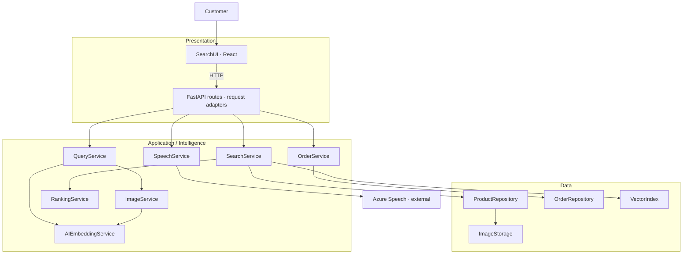
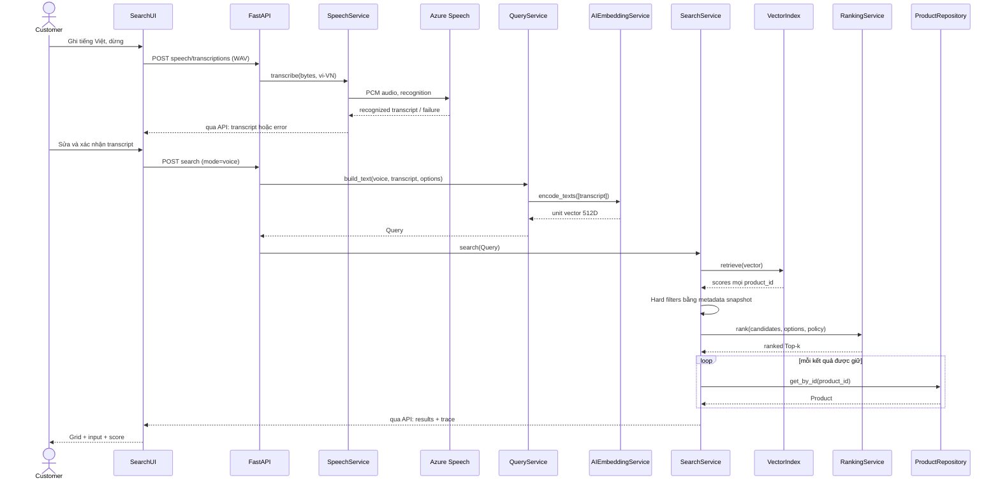

# Kiến trúc và hợp đồng service

## Stack và tổ chức

Python 3.12, FastAPI/Pydantic, NumPy, Pillow, PyTorch CPU, Sentence Transformers, Azure Speech SDK. Frontend React + TypeScript + Vite, React Router, một API client. Dùng JSON read-only cho demo, NPZ cho vectors; không thêm Redis/Celery/vector DB ở quy mô này. Package versions khóa sau smoke test tại milestone M0; không gọi “latest” trong bản bàn giao.

FastAPI là adapter presentation phía server. `app/main.py` là composition root, được phép tạo tất cả dependencies rồi inject; route không tự new model/repository. `domain/` chứa DTO/protocol/lỗi, không import React/FastAPI/Azure. Data implement protocols trong domain; Application không import Presentation. Browser không import Python Data hoặc đọc storage.

## Trách nhiệm và method signatures

| Module đích | Public operation | Contract |
| --- | --- | --- |
| `application/query_service.py` | `build_text(mode, text, options, voice_source=None) -> Query` | Validate text/voice, encode normalized 512D; voice đã có transcript |
| `application/query_service.py` | `build_image(image_bytes, options) -> Query` | ImageService validate/decode; encode image |
| `application/query_service.py` | `build_multimodal(text, image_bytes, options, text_weight) -> Query` | Encode cả hai, fusion theo 05; giữ component vectors |
| `application/embedding_service.py` | `encode_texts(texts)`, `encode_images(images) -> ndarray[B,512]` | Singleton CPU; finite unit vectors; đúng model pair |
| `application/image_service.py` | `decode(image_bytes) -> RGB image` | Enforce MIME/format/size/pixel limits; orientation/alpha theo 05 |
| `application/speech_service.py` | `transcribe(wav_bytes, language) -> Transcription` | Validate WAV trước Azure; deadline; không gọi search |
| `application/search_service.py` | `search(query) -> SearchResponse` | Snapshot index+catalog→all scores→hard filters→rank→hydrate |
| `application/search_service.py` | `view_product(product_id) -> Product` | Validate ID; repository lookup, không cần model |
| `application/ranking_service.py` | `rank(candidates, options, policy) -> list[Candidate]` | Filter threshold nếu relevant, full precision stable sort, top_k cuối |
| `application/order_service.py` | `search_order(customer_context, order_id)` / `view_order(...)` | Exact ID + scope server, 404 như nhau cho foreign/missing |
| `data/product_repository.py` | `all_products()`, `get_by_id(id)` | Validated immutable snapshot; copy-safe output |
| `data/order_repository.py` | `find_order(customer_id, order_id)` | Scope cùng lookup, không trả foreign rồi filter UI |
| `data/vector_index.py` | `load(snapshot)`, `retrieve(vector) -> list[Candidate]` | Validate version/fingerprint, exact scan; không load model |
| `scripts/build_index.py` | CLI orchestrator | Tạo embedding qua AIEmbeddingService rồi publish NPZ; Data không import Application |

`SpeechService.transcribe` đổi từ simulated contract cũ sang bytes WAV. API transcribe tách khỏi API search để người dùng sửa transcript. Sequence UML phải cập nhật theo quyết định này, không giữ lời gọi cũ nhưng gắn audio vào tham số string.

## Runtime và dependency failure

- Uvicorn **một worker**; model pair load một lần; CPU inference bounded bằng semaphore một lượt active, tối đa hai lượt chờ. Quá hàng đợi→429 `SEARCH_BUSY`, Retry-After 2s; không tạo thread không giới hạn.
- Blocking inference/SDK chạy trong executor có giới hạn, không block event loop. Request bị timeout vẫn giữ slot tới khi worker thật kết thúc; không coi `asyncio` cancel là đã dừng native SDK.
- Search deadline backend **10s**, tính từ nhận xong body upload qua validation, queue, inference đến DTO; browser **15s**. Hết hạn→504 `SEARCH_TIMEOUT`, bỏ response muộn. Request hết hạn khi còn trong queue không được chạy encoder sau đó; request đã inference thì giữ slot tới completion thật. Không auto retry. Worker treo không kết thúc phải báo search unavailable và phục hồi bằng restart theo runbook; không mở thêm threads để vượt giới hạn.
- Catalog/order/static routes và `/health/live` hoạt động khi model unavailable. `/health/ready` chỉ ready khi product semantic search dùng được; voice/policy capability có trạng thái riêng.
- Startup chỉ đọc cache và model local đã download, không gọi Azure. Nếu cache missing/stale/corrupt, search trả 503 với hướng dẫn build; chạy script build trước lần khởi động kế tiếp. Không rebuild catalog trong từng request.
- Catalog + index là cùng fingerprint snapshot, bất biến trong process. Update dataset chạy offline, build index, restart; không vừa sửa JSON vừa phục vụ phiên cũ.
- Azure cấu hình thiếu làm voice unavailable; text/image/order vẫn hoạt động. Voice lỗi không fallback âm thầm sang mock.

## Sequence voice end to end

Ở VP phải thêm `alt` cho WAV/input sai, Azure failure, empty ranked; không đi vào Q/S khi STT chưa được người dùng xác nhận. Các dependency không được biểu diễn như inheritance.
