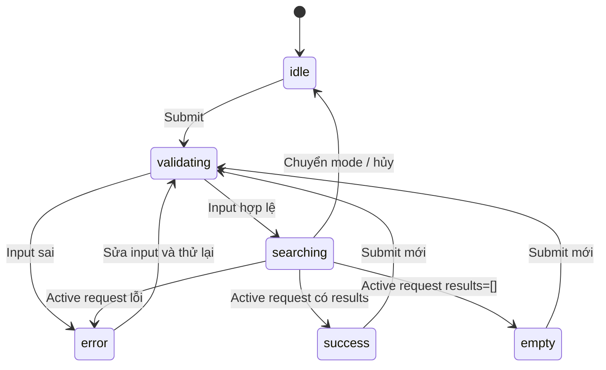

# Đặc tả giao diện website tiếng Việt

## Cấu trúc trang và route

| Route | Nội dung | Backend |
| --- | --- | --- |
| `/` | Search workspace, catalog khởi đầu, results, input/processing panel | meta, products, search APIs |
| `/products/:productId` | Ảnh thật, tên/màu/brand/category, mô tả, stock, giá demo, credit | product detail/media |
| `/orders` | Form mã đơn hàng, summary của C001 | order lookup |
| `/orders/:orderId` | Date/status/items/total demo | scoped order detail |
| `/credits` | Danh sách ảnh sử dụng, nguồn/tác giả/license/biến đổi | GET `/api/v1/credits` |
| `*` | Trang không tồn tại, link về search | Không gọi model |

Route detail phải chạy khi mở trực tiếp và reload. Header navigation “Tìm sản phẩm”, “Đơn hàng”, “Nguồn ảnh”; hiển thị nhỏ “Dữ liệu minh họa · Khách hàng C001”. Không tạo nút Mua/Checkout hay CRUD không có backend contract.

## Trang tìm kiếm

Thứ tự thông tin: tiêu đề “Tìm sản phẩm theo cách của bạn”→tabs “Mô tả”, “Giọng nói”, “Hình ảnh”, “Mô tả + ảnh”→input→filter/options→submit→results. Catalog là trạng thái ban đầu, không gắn điểm AI giả. Grid ảnh thật là vùng nổi bật; trace kỹ thuật nằm trong panel mở rộng “Xem cách hệ thống xử lý” để hỗ trợ demo.

### Input controls

| Mode | Controls | Primary action |
| --- | --- | --- |
| text | Textarea tiếng Việt, ví dụ “giày chạy bộ màu đen”, counter≤500 chars | “Tìm kiếm” |
| voice | Mic Bắt đầu/Dừng, timer15s; upload WAV; transcript editable; nhãn nguồn | “Nhận dạng lời nói”, sau đó “Tìm theo lời nói” |
| image | File picker + drop zone, accept jpg/png/webp, preview tên/size, thay/xóa ảnh | “Tìm bằng ảnh” |
| multimodal | Textarea + file preview + slider text_weight .1–.9 step .1 | “Tìm kết hợp” |

Không chỉ ghi accept để coi upload hợp lệ: client kiểm tra nhanh, server kiểm tra bytes thật. Không nhận đường dẫn filesystem hoặc URL ảnh do user nhập. Image preview dùng object URL, revoke khi thay ảnh/rời trang.

Options chung: Top-k select5(default)/1/3/10/20; category và brand từ `/meta`; min/max price VND; checkbox “Chỉ còn hàng”; result policy nearest(default)/relevant. Price format với `Intl.NumberFormat('vi-VN', {style:'currency',currency:'VND'})`; nội bộ gửi integer, input0 được chấp nhận, không biến chuỗi rỗng thành0.

Nhãn nearest: “Các sản phẩm gần nhất · chưa lọc mức liên quan”. Relevant: “Chỉ giữ kết quả đạt ngưỡng đã hiệu chỉnh”. Không dùng nhãn “chính xác 95%” hoặc progress ring từ score. Nếu policy unavailable, disable relevant có lý do; khi slider khác .5 không có policy, chuyển option draft về nearest có thông báo trước submit, không đổi response cũ thành mode mới.

Filter price/brand là control tường minh. Hint: “Muốn giới hạn giá hoặc thương hiệu, đặt bộ lọc bên dưới.” Không để user nghĩ câu “dưới 2 triệu” đã tạo hard filter trong khi query.options không có max_price.

### Kết quả và details

Card gồm ảnh `object-fit:contain` không cắt mất chủ thể, name, màu, brand, price, badge stock và rank. Search result thêm “Cosine: 0.742”; show3decimals, không %. Components multimodal ở phần giải thích, không thêm tổng/weighted score sai công thức. Click toàn card hoặc link title mở detail keyboard được.

Results header hiển thị query đã submit, mode, effective filters, số trả về, policy, thời gian backend. Trace các bước validate→encode→retrieve→filter→threshold→rank→hydrate từ response thực. Không animate steps như đã chạy xong khi server chưa trả. Input ảnh hiện thumbnail local; không đưa vector, API key hoặc file path vào panel.

Detail giữ tên/ảnh nhất quán card. “Giá và tồn kho là dữ liệu demo” nằm cạnh metadata. Credit: tác giả, source page, license link, thumbnail/resize disclosure; link external `rel="noopener noreferrer"` nếu mở tab mới. Ảnh tải lỗi dùng vùng neutral + alt mô tả và nút thử lại, không sinh ảnh thay thế.

## State machine và tránh lỗi request cũ

Mỗi request có sequence ID và AbortController; chỉ response ID còn active và đúng mode mới cập nhật result/error/loading. Hủy request không đảm bảo server dừng inference; server quản lý slot theo 03. Thay text/filter/weight đánh dấu draft khác submitted và hiện “Đã đổi điều kiện, hãy tìm lại”; giữ results cũ cùng summary đã submit, không gắn nhãn input mới cho kết quả cũ.

Submit disable khi cùng workflow pending để ngăn double click. Chuyển tab hủy active request, đóng mic và dừng tracks; lưu draft per-mode trong memory. Back từ detail giữ draft/results/scroll trong SPA. Reload chỉ cần khôi phục mode + bộ lọc nếu được lưu trong sessionStorage; không lưu audio/blob/key, không hứa giữ ảnh qua reload. URL không ghi transcript hoặc nội dung nhạy cảm.

Search fetch có timeout 15s; 504 `SEARCH_TIMEOUT` hoặc browser timeout kết thúc pending/loading, giữ draft và hiện “Tìm kiếm quá thời gian, hãy thử lại”. Không tự retry, không nhận response muộn. Deadline STT tách riêng 30s theo08.

## Voice states riêng

`idle → permission_pending → recording → ready_to_transcribe → transcribing → transcript_ready → searching`.

- Mic indicator + elapsed; auto-stop15s; manual Stop luôn khả dụng. Rời tab/route/unmount dừng tracks, đóng audio context/worklet; cancel transcript request.
- Permission denied/device missing/insecure context có hướng dẫn và upload WAV. Không lặp prompt permission tự động.
- Recognition thành công mới hiện nhãn “Azure Speech · tiếng Việt”. Người dùng sửa transcript thì giữ nhãn “Đã chỉnh sửa transcript”, không ghi đó là raw recognition result.
- Nhập tay là lựa chọn rõ “Transcript nhập tay · mô phỏng”; vẫn search mode voice nhưng voice_source=manual_transcript. Không trình diễn giả mic wave animation cho mode này.
- NoMatch: “Chưa nhận được lời nói, hãy ghi lại một câu ngắn”; Azure auth/config/rate/timeout có message sanitize và retry thủ công. Không tự gửi lại audio tính phí.

## Empty và recovery

| Trường hợp | UI | Hành động |
| --- | --- | --- |
| Filter loại mọi sản phẩm | “Không có sản phẩm đáp ứng bộ lọc” | Xóa/đổi filter rồi submit |
| Threshold loại mọi sản phẩm | “Chưa có sản phẩm đạt ngưỡng liên quan” | Đổi mô tả/ảnh hoặc chọn gần nhất |
| Catalog rỗng | “Danh mục demo chưa có sản phẩm” | Không mời thử semantic input vô ích |
| Model/index unavailable | “Tìm kiếm AI chưa sẵn sàng” | Catalog/order vẫn xem được; hint setup trong help demo |
| 422 field error | Inline bên control + focus lỗi đầu | Giữ draft, không clear ảnh hợp lệ khác |
| 429/search busy | Nêu đang bận, nút thử lại sau Retry-After | Không spinner vô hạn |
| Order foreign/missing | “Không tìm thấy đơn hàng” | Giữ mã để chỉnh; không tiết lộ chủ sở hữu |

## Thiết kế, responsive và accessibility

Người dùng xác nhận Cortis theo hướng showroom mẫu vật: ảnh chụp thật, nền đá sáng #f6f5f3, chữ #211c22, màu hành động đỏ rượu #60283b và nền đất nhạt #eddfda. Be Vietnam Pro có dấu Việt được đóng gói local qua Fontsource, không phụ thuộc tải font từ mạng lúc sử dụng. Form trong bố cục showroom hai cột desktop; mobile chuyển một cột, filter thu gọn, grid 2–3 cột tùy viewport. Controls chính≥44px, body16px; chi tiết phụ có cấp chữ nhỏ hơn và contrast rõ.

Tabs có role/tablist, keyboard trái/phải, aria-selected và label; form control có label thật; lỗi aria-describedby. Loading/results announce `aria-live=polite`; modal nếu có focus trap/escape/return focus. Preview có alt mô tả sản phẩm; drag-drop luôn có file picker tương đương. Không phân biệt stock/error chỉ bằng màu; contrast text≥4.5:1; tôn trọng reduced-motion.

Kiểm tra 360/768/1440px, bàn phím toàn workflow, axe với serious/critical issues=0 và console errors=0 cho happy path. Mic hardware/permission review thủ công bổ sung E2E; mock browser permission không chứng minh voice thật.
