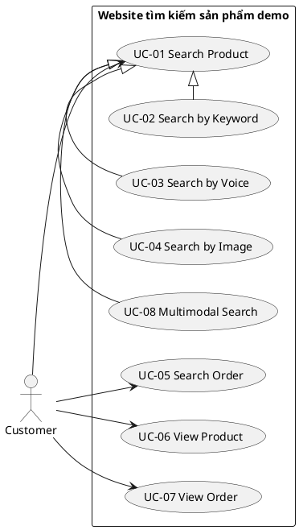
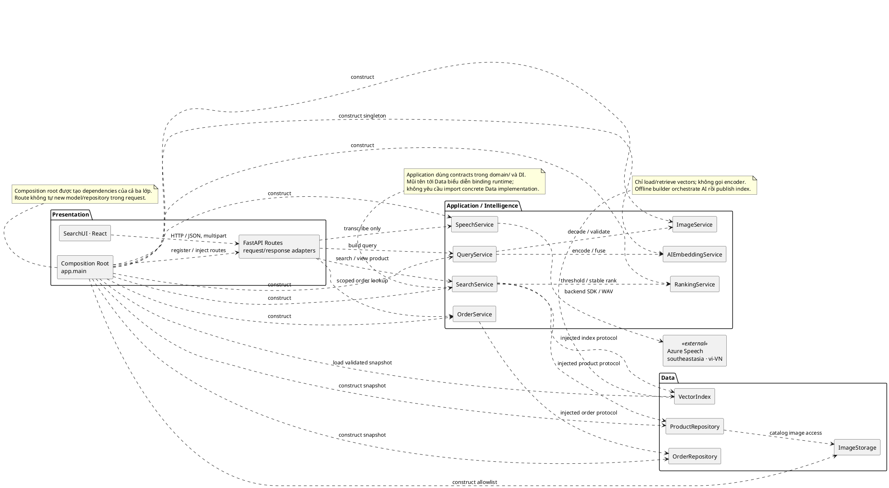
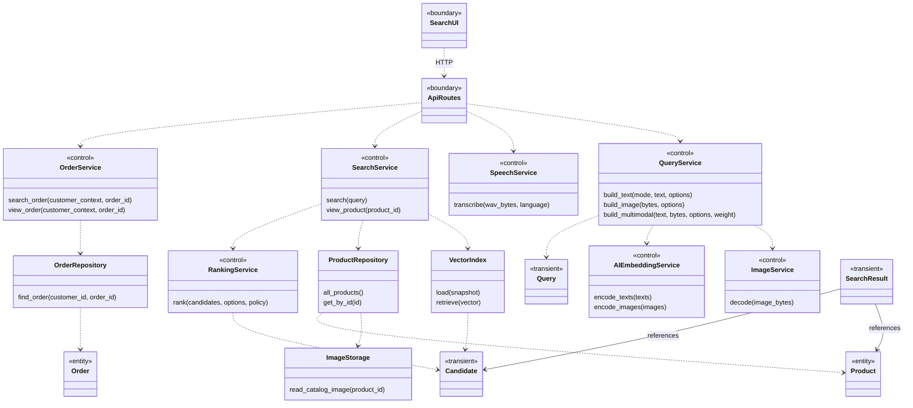
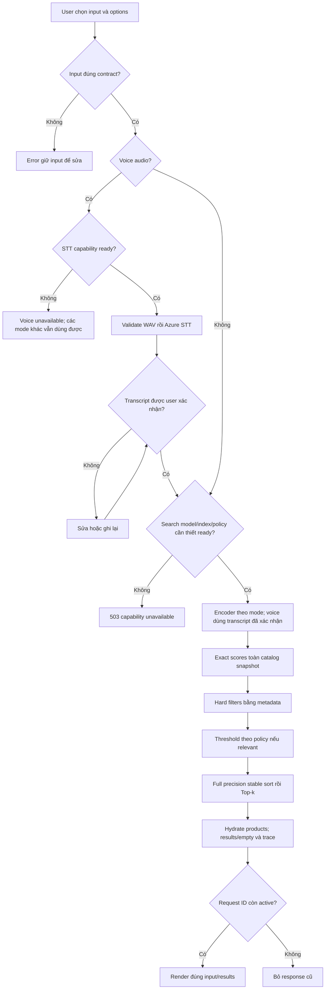
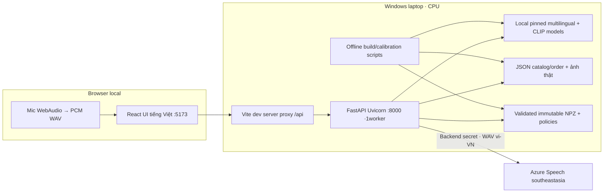

# Kịch bản demo và bàn giao UML

**Hiện tại:** đây là kịch bản/UML đích để Agent triển khai, không phải evidence website đã hoạt động. Khi app hoàn thành, export sơ đồ và artifacts theo phần cuối, kiểm tra chúng khớp code thật.

## Demo end to end, khoảng 8–12 phút

Điều kiện: tracker G1–G9 ở [10](10_TESTING_ACCEPTANCE.md) đạt; backend8000/frontend5173 đã chạy; model/index/policy warm đúng fingerprint; Azure Speech có cấu hình vi-VN; query fixtures và real image credits đã review. Nếu chưa đạt một dependency gate, ghi capability pending và trình bày giới hạn đúng; không gọi đó là bản demo đầy đủ.

| Bước | Thao tác trên website | Điều cần chứng minh / evidence |
| --- | --- | --- |
| 1 | Mở Search, đọc các mode và capability | UI tiếng Việt, nhãn demo C001, giá/tồn kho giả định; ảnh thật; readiness body gắn version |
| 2 | Text: nhập “giày chạy bộ màu đen”, nearest, K5 | Query summary đúng, results finite cosine + nguồn; nearest có nhãn không bảo đảm liên quan; không hứa P001 đứng1 trước khi đo |
| 3 | Đặt brand/category/max_price bằng controls và tìm lại | Filter cứng VND inclusive, số kết quả có thể <K; trace/options đúng; không tuyên bố NLP tự hiểu giá |
| 4 | Relevant: dùng positive và OOD fixture frozen | Positive đạt theo report; OOD có thể empty theo threshold; nếu fixture không empty phải nói đúng kết quả, không sửa output để trình diễn |
| 5 | Image: upload ảnh query thật khác góc từ `data/queries` | Preview/source, decode→encode→rank, score/timing thật; ảnh catalog self-match chỉ là smoke nếu có dùng |
| 6 | Multimodal: ảnh + mô tả, weight .5 rồi .7, tìm lại | Fusion query thật, component scores; .7 dùng nearest nếu chưa có calibrated policy; không claim weighted scores chưa normalize |
| 7 | Voice: record vi-VN1–15s, dừng, chờ Azure | Transcript source Azure; người dùng sửa/xác nhận mới search; mic tracks dừng; lỗi/no-match không bị che |
| 8 | Chọn manual transcript offline và quay lại | Nhãn “Transcript nhập tay · mô phỏng” rõ; phân biệt evidence với voice Azure thật |
| 9 | Click product detail và Back | Metadata/stock/giá demo, image/license/source credit; state search được giữ, direct reload hoạt động |
| 10 | Search Order O001, mở detail; thử O002 và O999 | O001 scoped C001 đúng tổng; foreign/missing đều cùng404; customer context không từ browser |
| 11 | Một input lỗi và search race A chậm/B nhanh | Validation message sửa được; response cũ không ghi đè mới; có loading/error/retry |
| 12 | Mở trace/report/UML | CPU/model revisions/fingerprint; Hit@3/OOD từng mode; p95 từng mode; 5bounded live calls; mapping ba lớp |

Không hardcode grid để ghi video đẹp. Nếu Azure outage lúc trình diễn, dùng evidence live đã chạy trước cùng version và ghi outage hiện tại, manual mode có nhãn; một dependency outage mới cần đánh giá lại theo gate, không biến mock thành live.

## Sơ đồ Use Case

Code tham chiếu PlantUML bên dưới thể hiện generalization đúng. Bản UML nộp theo Assignment phải được dựng và lưu trong Visual Paradigm `.vpp`; Mermaid/PlantUML ở tài liệu này là nguồn hướng dẫn tái dựng, có thể render để review nhưng không thay file `.vpp`. Không giả định VP trực tiếp import Mermaid/PlantUML ở mọi edition. Customer là actor chính; Azure được mô tả dependency external trong sequence/deployment. UC-02/03/04/08 specialize UC-01; không `include` cả ba modality trong một request.



View Product/View Order có thể mở direct link nên không bắt buộc include vào Search Product/Search Order. Association biểu diễn khả năng tương tác, không thay sequence/triggers ở 02.

## Three-Layer Component/Package Diagram

Assignment trong `CONTEXT.md` yêu cầu thể hiện kiến trúc ba lớp. Component/Package Diagram bên dưới bổ sung cho Class Diagram: package thể hiện ranh giới Presentation/Application/Data; component thể hiện module chịu trách nhiệm; dependency thể hiện việc sử dụng service hoặc protocol được inject theo03.



Các dependency không phải generalization/inheritance. Data không phụ thuộc Presentation hoặc Application để load model/tính ranking. `domain/` giữ DTO/protocol/error độc lập framework theo03; đây là hợp đồng dùng chung, không tạo thêm một lớp runtime thứ tư trong sơ đồ ba lớp. Azure nằm ngoài boundary hệ thống, browser không giao tiếp trực tiếp hoặc giữ secret Azure.

Khi dựng Visual Paradigm:

1. Tạo project `assignment6_demo.vpp` và ba package `Presentation`, `Application`, `Data`; tạo component đúng tên trên trong Model Explorer rồi đặt vào Component Diagram.
2. Tạo các class/service/entities của Class Diagram dưới package tương ứng. Component và class là các UML element khác loại; giữ mapping component→module/classes, không thay component bằng một box chữ giả.
3. Với cùng một UML element, kéo/reuse từ Model Explorer sang diagram khác thay vì tạo bản sao có cùng tên. Lifeline trong sequence tham chiếu class/component tương ứng khi công cụ hỗ trợ; method messages dùng signatures ở03.
4. Dựng Use Case/Sequence/Activity/Deployment trong cùng project, reuse actor Customer và các service/data elements, kiểm tra dependency direction và scope order.
5. Save `.vpp`, đóng/mở lại để xác minh project editable, export diagrams SVG/PDF đọc được; đối chiếu mapping code/tests bên dưới sau implement.

Chưa tạo `.vpp` ở bước đặc tả hiện tại; đây là artifact bắt buộc của đợt bàn giao UML Assignment sau triển khai, không được đánh dấu đạt bằng các code fence trong Markdown.

## Class Diagram ba lớp

Trường/method rút gọn để thấy trách nhiệm; DTO đầy đủ theo 04/06. Protocol nằm domain, implementation Data; composition root inject vào services. Các mũi tên dotted là dependency, không inheritance. SearchResult tham chiếu Product, không sở hữu vòng đời Product.



Data chỉ lưu/load vectors, không tự gọi AIEmbeddingService. Script build index orchestrate encoder rồi write Data. Product/order detail không phụ thuộc model readiness. Voice API không tìm sản phẩm trước khi user xác nhận transcript.

## Sequence search chung

```mermaid
sequenceDiagram
  actor C as Customer
  participant U as SearchUI
  participant API as FastAPI
  participant Q as QueryService
  participant AI as AIEmbeddingService
  participant S as SearchService
  participant VI as VectorIndex
  participant R as RankingService
  participant PR as ProductRepository
  C->>U: Chọn mode, input, options; submit
  U->>API: Search request theo JSON/multipart contract
  API->>API: Validate input, readiness, bounded slot
  alt Invalid input hoặc unavailable
    API-->>U: Error typed 422/503/429
    U-->>C: Giữ input, recovery rõ
  else Valid request
    API->>Q: build_text / build_image / build_multimodal
    Q->>AI: Encode local CPU; image validate trước encoder
    AI-->>Q: Finite unit vector(s)512D
    Q-->>API: Query fused + options
    API->>S: search(Query)
    S->>VI: retrieve(query.vector)
    VI-->>S: Scores toàn snapshot catalog
    S->>S: Hard filter metadata
    S->>R: threshold nếu relevant; stable rank; Top-k
    R-->>S: Selected candidates hoặc empty
    loop Candidate được giữ
      S->>PR: get_by_id(product_id)
      PR-->>S: Product metadata
    end
    S-->>API: Results + trace + policy metadata
    API-->>U: 200 results/empty reason
    U->>U: Chỉ apply nếu request ID còn active
    U-->>C: Grid hoặc empty, score/input/options đúng
  end
```

Điều kiện policy/readiness thực hiện trước inference khi có thể; hard-filter và threshold đều trước Top-k. Sơ đồ không có union Top-k từng modality. Sequence voice đầy đủ đã ở [03](03_ARCHITECTURE.md); khi vẽ VP thêm `alt` WAV invalid, STT failure và user cancel. Hai HTTP calls độc lập là `/speech/transcriptions` rồi `/search` sau xác nhận.

## Sequence order có scope

```mermaid
sequenceDiagram
  actor C as Customer
  participant U as OrderUI
  participant API as FastAPI
  participant O as OrderService
  participant OR as OrderRepository
  C->>U: Nhập O001 / mở direct detail
  U->>API: GET lookup/detail theo06
  API->>API: Validate order_id; customer_context=C001 từ backend
  API->>O: search_order / view_order(context, id)
  O->>OR: find_order(C001, id)
  alt Owned order tồn tại
    OR-->>O: Order snapshot
    O-->>API: Summary/detail đúng fields
    API-->>U: 200 không trả customer_id
    U-->>C: Date/status/items/total demo
  else Missing hoặc thuộc C002
    OR-->>O: Not found
    O-->>API: Same not-found error
    API-->>U: 404 cùng message
    U-->>C: Không tìm thấy đơn hàng
  end
```

Tìm đơn hàng exact ID; không QueryService, CLIP hoặc RankingService. Client `customer_id` bị reject, không dùng để override server context.

## Activity runtime và deploy local



Activity này là workflow tổng quát. Capability STT và search được kiểm tra **tại endpoint riêng tương ứng**: transcribe không cần model/index sẵn sàng. Error/NoMatch quay về user sửa/ghi lại theo 08; không tự đi vào encoder.



Model download xảy ra bước setup; browser không giữ key; ảnh catalog được serve local. Deployment này cho demo local, không khẳng định production auth/hosting. Nếu dựng site public sau này, phải có yêu cầu và đặc tả bổ sung; không thay hosting trong bước docs này.

## Mapping UML → code → tests

| UML phần tử | Module triển khai đích | Acceptance |
| --- | --- | --- |
| Three-Layer packages/components và DI | `backend/app/domain`, `presentation`, `application`, `data`, `main.py`; `frontend/src` | AC-033–034; `.vpp` editable + exports Component/Package Diagram |
| SearchUI, modes/filter/results/trace | `frontend/src/pages`, `components`, `hooks`, `api` | AC-001, 007, 009, 011, 023–024, 029–030, 039–040 |
| API boundary/composition root | `backend/app/main.py`, `presentation`, `settings.py` | AC-003–006, 019, 028, 033, 040–043 |
| Query/Image/AI services | `application/query_service.py`, `image_service.py`, `embedding_service.py` | AC-001–005, 012–013, 031, 034–035 |
| SpeechService và Azure adapter | `application/speech_service.py` | AC-006, 008–010, 028, 036, 041 |
| Search/Ranking services | `application/search_service.py`, `ranking_service.py` | AC-012–018, 022, 030, 043 |
| OrderService/repository | `application/order_service.py`, `data/order_repository.py` | AC-025–026, 039 |
| ProductRepository/ImageStorage | `data/product_repository.py`, `image_storage.py` | AC-024, 027, 037, 042 |
| VectorIndex/policies/builder | `data/vector_index.py`, `scripts/build_index.py`, `calibrate_thresholds.py` | AC-019–021, 031, 034–035, 038 |

Đây là mapping dự kiến. Sau implement ghi tên class/method thật, không để sơ đồ chứa method không tồn tại hoặc đổi signature mà không sửa 03/06/UML.

## Artifacts bàn giao cuối triển khai

- `artifacts/demo/uml/assignment6_demo.vpp`: **project Visual Paradigm bắt buộc** theo Assignment, chứa UML editable và tái sử dụng elements đúng; xác minh save/đóng/mở lại thành công. Source Mermaid/PlantUML hướng dẫn trong Markdown không thay artifact này.
- `artifacts/demo/uml/`: exports SVG/PDF Use Case, Three-Layer Component/Package, Class, search/voice/order Sequence, Activity, Deployment; render kiểm tra chữ và arrows đọc được, các diagram khớp cùng project `.vpp` và code.
- `artifacts/demo/demo-checklist.md`: bước1–12 actual result, version/fingerprints, links screenshots/video đã loại secret, pending/fail nếu có.
- `artifacts/evaluation/`: frozen split hash, calibration/policy report, raw test results từng mode, live5 voice report.
- `artifacts/performance/`: hardware/config, cold/warm timings và p95 từng mode.
- `artifacts/e2e/`: happy/error/race/viewport/order tests; `artifacts/validation/`: schema/images/hash/source/contract reports.
- README thực chạy bằng commands ở11; tracker G1–G9 ở10 có evidence tương ứng.

Trong giai đoạn hiện tại chỉ bàn giao đặc tả. Các artifact/runtime gate ở trên được tạo sau implement; không tự điền checkbox hoặc results giả cho lần review tài liệu này.
