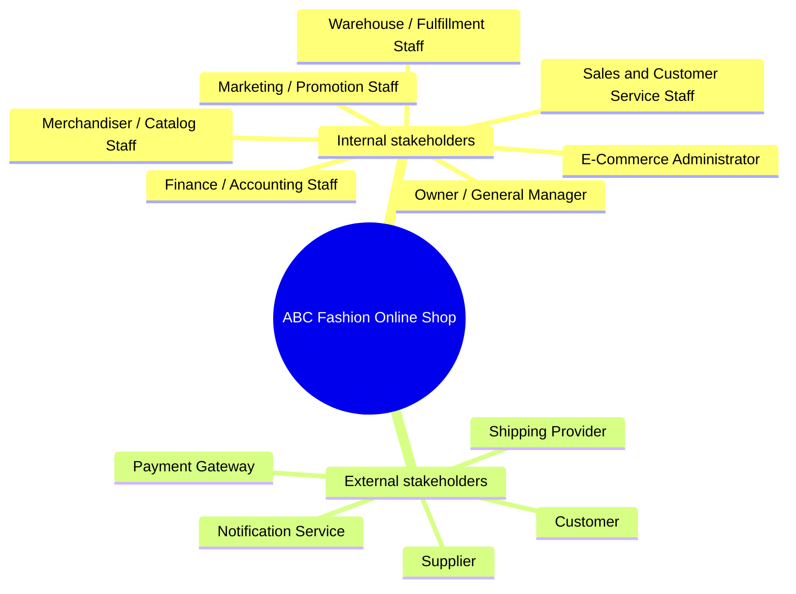
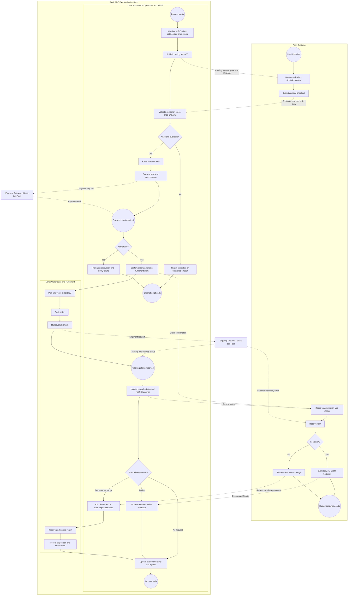
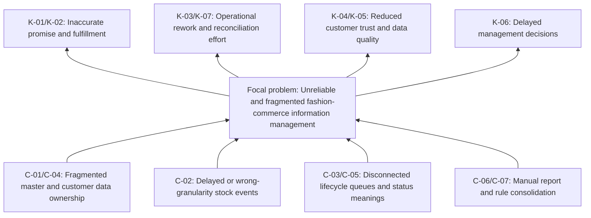
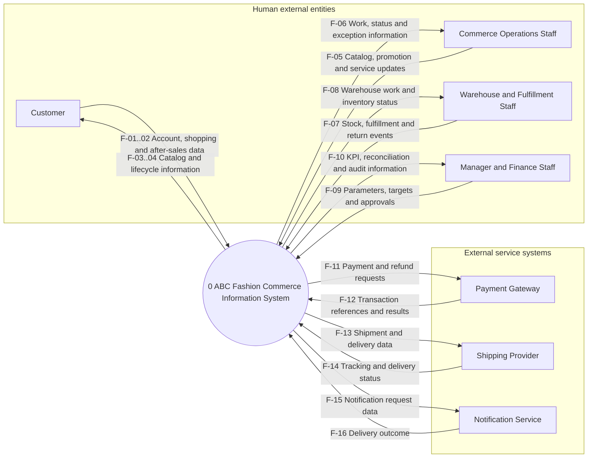

# ABC Fashion Online Shop

## E-Commerce Information System Investigation Report

| Report field | Value |
|---|---|
| Course | Information System Analysis and Design |
| Assignment | Assignment 01 |
| Selected domain | Fashion E-Commerce |
| Case organization | ABC Fashion Online Shop |
| Student ID | `[Insert Student ID]` |
| Student name | `[Insert Student Name]` |
| Version | 1.0 |
| Date | 26 August 2026 |
| Required PDF filename | `A01_StudentID_Name.pdf` |

> **Submission note.** This is the detailed master report in Markdown. When submitted, keep Sections 1-8 at approximately 6-8 PDF pages and place the detailed model-construction registers, validation record, and traceability material in appendices. This resolves the assignment cover-page recommendation of 8-10 pages and the more specific Section 16 requirement of approximately 6-8 pages by treating Section 16 as controlling for the main report.

> **Modeling constraint.** Assignment 01 requires investigation before detailed software design. This report therefore contains exactly three **core diagrams**: a Stakeholder Map, a High-Level Business Process, and a System Context Diagram. It does **not** contain a UML Use Case Diagram, ERD, database schema, component design, or implementation architecture. The separately required Problem Tree is labeled `PT-1` as a supporting problem-analysis artifact, not as a fourth core diagram.

> **Visual Paradigm delivery convention.** Each model has (1) an inline Mermaid preview so the Markdown remains readable and (2) a Visual Paradigm native-element construction register in Appendix A. The register is the modeling source of truth. Build the submission figures in Visual Paradigm using its native Mind Map, BPMN 2.0 Business Process Diagram, DFD/System Context Diagram, and Current Reality Tree elements; do not claim that the Mermaid preview itself is a Visual Paradigm project file.

---

## Executive Summary

ABC Fashion Online Shop is modeled as a medium-sized, business-to-consumer retailer that owns the merchandise it sells through an online storefront. The selected fashion specialization changes the generic case materially: a style such as a shirt is not the unit that is stocked or fulfilled. Each sellable combination of size, color, and other differentiating attributes is a distinct **Product Variant** with its own SKU, availability, and fulfillment identity. GS1 guidance similarly treats each size/color combination as a separate product variation, while Google Merchant Center distinguishes a stable variant group from its individual variants [R6], [R7].

The investigation finds one focal business problem: **fragmented and unreliable fashion-commerce information prevents the business from coordinating product variants, stock, orders, delivery, returns, customers, and management reporting as one end-to-end process**. The assignment provides direct evidence of inconsistent product data, outdated inventory, manual order work, unclear order status, manually prepared reports, fragmented customer information, and limited real-time management information [R1]. Fashion-specific concerns about variant identity, size and fit information, and return/exchange handling are evidence-based hypotheses that must be validated with ABC stakeholders rather than treated as observed facts.

The proposed **ABC Fashion Commerce Information System (AFCIS)** centralizes style and variant information; customer, cart, order, promotion, and inventory records; fulfillment and return workflows; customer-facing status; and operational reporting. Payment authorization, carrier operations, and message delivery remain external services. The system is intended to create a reliable information backbone, not merely a storefront. Seven preliminary objectives connect directly to the identified problems and include measurable indicators that must be baselined and approved in Assignment 02.

---

## Table of Contents

1. [Introduction](#1-introduction)
2. [Business Background](#2-business-background)
3. [Stakeholder Analysis](#3-stakeholder-analysis)
4. [Business Activity Analysis](#4-business-activity-analysis)
5. [Information Analysis](#5-information-analysis)
6. [Current Problems](#6-current-problems)
7. [Proposed Information System](#7-proposed-information-system)
8. [Conclusion](#8-conclusion)
9. [References](#9-references)
10. [Appendices](#10-appendices)

---

# 1. Introduction

## 1.1 Purpose and central question

This report investigates the real-world business and information problem that a proposed information system should address for ABC Fashion Online Shop. It answers the assignment's central question:

> **What problem should the information system solve?**

The report moves in the required direction: organization -> business activities -> stakeholders -> information -> problems -> system scope -> system objectives. It deliberately avoids solution-first thinking and detailed requirements or implementation design [R1].

## 1.2 Investigation questions

The analysis answers the six required questions:

1. What is the business?
2. Who participates in or is affected by it?
3. What does the business do?
4. What information does it produce, consume, store, and exchange?
5. What significant problems, causes, and consequences exist?
6. What information system and boundary should be considered?

## 1.3 Method and evidence hierarchy

This is a desk-based investigation using document analysis and domain benchmarking. IIBA recognizes document analysis, stakeholder analysis, current-state analysis, and explicit scope definition as business-analysis practices [R3], [R4]. ISO/IEC/IEEE 29148:2018 provides a lifecycle framework for requirements-engineering processes and information items [R5]. The repository materials were reviewed in full, including the assignment extraction, the context-diagram article, and the learning notes derived from Wiegers and Beatty [R1], [R2], [R15]. The separation of business evidence, requirements, analysis models, and later design is also consistent with established requirements and systems-analysis texts [R16], [R18], [R19].

Evidence is prioritized as follows:

| Priority | Evidence source | Use in this report |
|---:|---|---|
| 1 | Attached Assignment 01 PDF | Governing deliverables, case facts, rubric, scope restrictions, and exactly three core diagrams |
| 2 | Case statements in the assignment | Direct current-state evidence about ABC Online Shop |
| 3 | Recognized standards and ISAD/requirements literature | Analysis discipline, terminology, traceability, BPMN, and DFD conventions |
| 4 | Fashion-commerce standards and research | Variant identity, product attributes, size/fit, and return-domain considerations |
| 5 | Repository supporting notes and article adaptation | Cross-checks for context diagrams, root-cause analysis, and information modeling |

The following evidence labels are used in Section 6:

- `CE` - case evidence explicitly stated in the assignment;
- `DE` - external fashion-domain evidence;
- `H` - hypothesis inferred for this particular organization and requiring validation;
- `DD` - preliminary design/scope decision made in this report.

## 1.4 Assumptions and limitations

The assignment describes a realistic but fictional case; it provides no interviews, observations, transactional data, organizational chart, policies, or system logs. The following assumptions make the analysis coherent without presenting inventions as facts:

1. ABC Fashion Online Shop is a single, medium-sized retailer that owns its stock; it is **not** a multi-vendor marketplace.
2. It sells apparel, footwear, and accessories to consumers through a responsive web storefront. Social and advertising channels may refer traffic, but the AFCIS storefront is the system of record for online orders.
3. One warehouse is assumed for the initial scope. The information model should not prevent later multi-location inventory, but that is not an Assignment 01 commitment.
4. Payment authorization is performed by an external Payment Gateway. AFCIS stores a gateway reference, amount, method category, and status, but not raw card numbers or card verification values.
5. Shipping is performed by an external Shipping Provider. ABC warehouse staff pick and pack orders; the carrier transports them.
6. Returns and size/color exchanges are included because they are material fashion-commerce activities, but the present return volume, policy, and failure rate are unknown.
7. Numerical success targets in Section 7.6 are provisional management targets. Baselines and final values require stakeholder approval in Assignment 02.

**Limitations:** no claim is made about current conversion rate, stock accuracy percentage, order-cycle time, return rate, refund age, or report-preparation effort. Appendix B defines how those baselines should be collected.

## 1.5 Controlled terminology

Consistent terminology is mandatory because these outputs will become actors, requirements, and use cases in Assignment 02 [R1].

| Term | Definition used throughout this report |
|---|---|
| Product Style | Parent commercial concept shared by related variants, for example, "Classic Oxford Shirt". A Product Style is browsable but is not itself the stocked unit. |
| Product Variant | One sellable combination of differentiating attributes, normally style + size + color and, when relevant, material/pattern/fit. It is the stock, order-line, return, and fulfillment unit. |
| SKU | ABC's unique internal identifier for one Product Variant. |
| GTIN | External GS1 trade-item identifier, when assigned. It does not replace the internal SKU. |
| On-hand Quantity | Physically recorded units for a Product Variant at a stock location. |
| Reserved Quantity | Units temporarily or firmly allocated to open orders and unavailable to other orders. |
| Available-to-Sell (ATS) | Quantity offered for new orders after subtracting reservations and any approved safety stock from eligible on-hand stock. |
| Customer | External person who browses, buys, tracks, reviews, returns, or exchanges products. The report does not alternate between Customer, Buyer, and User. |
| Order | Commercial request containing one or more Product Variant order lines, price snapshots, delivery information, and lifecycle status. |
| Payment | Authorization/capture/refund business record linked to an Order and an external gateway transaction reference. |
| Shipment | Fulfillment consignment with packaged order lines, carrier/tracking information, and delivery status. |
| Return | Authorized movement of a delivered Product Variant back to ABC for inspection and disposition. |
| Exchange | Return of one Product Variant and allocation of a replacement Product Variant, commonly another size or color. |
| Refund | Financial reversal initiated through the external Payment Gateway. |

## 1.6 Progressive review method

Before a downstream stage is accepted, the upstream stage is checked using the following gates. Results are recorded at the relevant section and consolidated in Appendix C.

| Gate | Must be true before proceeding |
|---|---|
| G1 - Business -> Stakeholders | Business purpose, ownership model, products, channels, objectives, and terminology are internally consistent. |
| G2 - Stakeholders -> Activities | Every major activity has an accountable/participating stakeholder; no system actor is silently invented. |
| G3 - Activities -> Information | Each activity has identifiable inputs and outputs; Product Variant remains the order, stock, fulfillment, and return unit. |
| G4 - Information -> Problems | Each problem names affected information and stakeholders; causes are distinguished from symptoms and consequences. |
| G5 - Problems -> Scope | Every in-scope capability addresses at least one significant problem; out-of-scope choices do not break an essential flow. |
| G6 - Scope -> Context | Every context entity crosses the software boundary with at least one named data flow, and every named flow appears in the flow catalogue. |
| G7 - Problems -> Objectives | Every objective traces to one or more problems and has a candidate indicator without pretending that an unmeasured baseline exists. |

---

# 2. Business Background

## 2.1 Organization

**ABC Fashion Online Shop** is a medium-sized B2C fashion retailer that selects, purchases, markets, sells, fulfills, and supports its own assortment of apparel, footwear, and accessories through online channels. Its primary business purpose is to convert a managed fashion assortment into reliable customer orders while giving customers enough product, size, fit, color, price, availability, delivery, and return information to choose confidently.

The organization creates value only when the selected Product Variant can be promised, paid for, picked correctly, delivered, and supported after delivery. Therefore, the business is not simply publishing a website: it coordinates product master data, merchandising, customers, promotions, orders, payments, variant-level inventory, warehouse work, shipping, returns/exchanges, reviews, and management information.

## 2.2 Business model

| Business-model aspect | Investigation finding |
|---|---|
| Customer segment | Online consumers purchasing apparel, footwear, and accessories for personal use; shoppers who require clear size, fit, color, and delivery information |
| Value proposition | Convenient discovery of fashion products; reliable size/color selection and availability; transparent order, shipment, return, and refund status |
| Revenue | Sale of owned merchandise, net of promotions, cancellations, returns, refunds, payment fees, and fulfillment costs |
| Primary channel | Responsive online storefront; external campaigns/social channels may direct traffic to it |
| Customer relationship | Self-service browsing, account/cart/checkout, proactive status notifications, customer support, reviews, returns and exchanges |
| Key resources | Product/variant information, stock, customer and order information, staff, warehouse operations, supplier relationships, payment and shipping partnerships |
| Key partners | Suppliers, Payment Gateway, Shipping Provider, and Notification Service |
| Major cost drivers | Merchandise procurement, content production, promotions, payment fees, warehouse labor, packaging, delivery, returns/exchanges, and customer support |

This scope intentionally excludes marketplace seller commissions and seller management because the selected domain is Fashion E-Commerce, not the separate Multi-Vendor Marketplace option in the assignment [R1].

## 2.3 Products and customers

### Product assortment

- Apparel: tops, shirts, dresses, trousers, denim, knitwear, outerwear, and similar categories.
- Footwear: shoes, sandals, and boots with size-system and fit attributes.
- Accessories: bags, belts, hats, jewelry, scarves, and similar products; some may have size/color variants.

The critical domain rule is that a style and a sellable variant are different information objects. GS1 states that every size/color combination is a separate product variation for identification purposes [R6]. Google product-data guidance likewise groups related variants using a stable item-group identifier while requiring variant attributes such as color, size, material, pattern, age group, and gender when relevant [R7]. ABC therefore needs a stable Product Style with one or more uniquely identified Product Variants.

### Target customer needs

Customers need to:

- discover products by category, search, price, size, color, material, fit, and availability;
- understand appearance, fabric/material, care, measurements, size system, fit guidance, and return conditions;
- select a specific available Product Variant rather than an ambiguous parent style;
- see the correct price and promotion before committing;
- receive dependable payment, order, shipment, delivery, return, exchange, and refund status;
- obtain support without restating information already held by the business.

Large-scale apparel UX research treats size/fit information, color variations, product visuals, cart/checkout, self-service, and the pre- and post-purchase returns journey as distinct fashion-commerce concerns [R8]. This evidence justifies investigating those information needs, but it does not prove that ABC's present implementation fails in every area.

## 2.4 Major business activities

At a high level, ABC performs the following activities:

1. assortment, category, Product Style, and Product Variant management;
2. pricing and promotion management;
3. customer and consent management;
4. product publication, browsing, search, filtering, and size/fit support;
5. shopping-cart and checkout management;
6. order and payment coordination;
7. variant-level inventory reservation and control;
8. warehouse picking, packing, shipping, and delivery-status coordination;
9. customer service, cancellation, return, exchange, and refund coordination;
10. review and fit-feedback management;
11. supplier/replenishment receipt administration; and
12. sales, inventory, returns, fulfillment, and management reporting.

These activities are analyzed in Section 4 and connected in Core Diagram 2.

## 2.5 Business objectives

| ID | Business objective | Observable business result |
|---|---|---|
| B-01 | Present a trustworthy, differentiated fashion assortment | Customers see complete, consistent style/variant, size, color, material, price, image, and availability information |
| B-02 | Fulfill the exact variant promised | Lower incidence of overselling, wrong-size/wrong-color picks, cancellation, rework, and avoidable support contact |
| B-03 | Operate orders efficiently from checkout through after-sales | Less re-keying and fewer disconnected handoffs across sales, warehouse, payment, shipping, and returns work |
| B-04 | Build customer trust and repeat purchase | Timely status, clear self-service, useful fit information, and controlled return/exchange/refund handling |
| B-05 | Improve management control | Timely, reconcilable views of sales, stock, promotions, returns, margin inputs, and operational exceptions |

### Review Gate G1 - passed

- The organization is consistently modeled as a single B2C, owned-inventory fashion retailer.
- The parent Product Style is never confused with the stocked Product Variant.
- Products, customer needs, channels, activities, and objectives support the same business purpose.
- Multi-vendor marketplace, physical POS, and implementation architecture have not been silently introduced.

---

# 3. Stakeholder Analysis

Stakeholders are people, groups, organizations, or services that participate in, influence, or are affected by the business and the proposed change. IIBA recommends identifying affected stakeholder groups, analyzing them, and revisiting the analysis throughout the initiative [R3], [R4]. Here, **internal/external** is classified relative to the ABC organization. In Section 7.4, an **external entity** is classified relative to the AFCIS software boundary; therefore, internal employees correctly appear outside the software process in the context diagram.

## 3.1 Internal stakeholders

1. **Owner/General Manager** - sponsors change, approves priorities and policy, and needs reliable decision information.
2. **E-Commerce Administrator** - manages accounts, roles, reference settings, workflow exceptions, and overall operational configuration.
3. **Merchandiser/Catalog Staff** - owns categories, Product Styles, Product Variants, descriptive attributes, size/fit guides, images, price publication, and product lifecycle state.
4. **Marketing/Promotion Staff** - creates campaigns, promotion rules, coupon conditions, schedules, and performance questions.
5. **Sales and Customer Service Staff** - supports customers, reviews order status, handles approved changes/cancellations, and coordinates return/exchange/refund cases.
6. **Warehouse/Fulfillment Staff** - receives stock, reconciles variant quantities, picks exact SKUs, packs orders, records shipment handoff, receives returns, and records disposition.
7. **Finance/Accounting Staff** - reconciles order amounts, payment/refund status, fees, and financial handoff information; the general ledger itself is outside AFCIS.

## 3.2 External stakeholders

1. **Customer** - browses, selects variants, purchases, tracks, reviews, returns, exchanges, and receives refunds.
2. **Supplier** - supplies merchandise and supporting product/variant information and receives replenishment communication; direct supplier-system integration is outside the initial system boundary.
3. **Payment Gateway** - performs payment authorization/capture/refund processing and returns transaction status.
4. **Shipping Provider** - accepts shipment requests, assigns tracking, transports parcels, and returns milestone/delivery status.
5. **Notification Service** - delivers approved email/SMS/push messages and returns delivery outcomes.

## 3.3 Stakeholder interests, information, and influence

| Stakeholder | Classification | Role and contribution | Main interest/need | Key information provided or received | Influence / engagement |
|---|---|---|---|---|---|
| Owner/General Manager | Internal | Sponsor and policy/priority decision-maker | Business visibility, benefits, risk control, timely exceptions | KPI definitions, targets; sales/stock/returns/operations reports | High / manage closely |
| E-Commerce Administrator | Internal | Controls access, settings, master references, and exceptions | Accurate, auditable, efficient administration | Account/role settings, workflow exceptions, audit information | High / manage closely |
| Merchandiser/Catalog Staff | Internal | Curates assortment and publishes style/variant content | One controlled product source; completeness and publication status | Style/variant attributes, size/fit guide, media, price/publication status | High / involve continuously |
| Marketing/Promotion Staff | Internal | Plans and evaluates promotions | Correct eligibility, schedule, price presentation, and campaign results | Promotion rules and dates; redemption/performance information | Medium-high / involve at rule reviews |
| Sales and Customer Service Staff | Internal | Resolves order and after-sales inquiries | Complete customer, order, payment, shipment, and return timeline | Approved changes, support notes, return requests; consolidated status | High / involve continuously |
| Warehouse/Fulfillment Staff | Internal | Controls physical stock and fulfillment events | Exact variant identity, actionable work queues, stock accuracy | Receipts, counts, pick/pack events, shipment handoff, return disposition | High / manage closely |
| Finance/Accounting Staff | Internal | Reconciles financial events | Complete, traceable payment/refund and order totals | Reconciliation results; payment, refund, fee, and order summaries | Medium-high / scheduled validation |
| Customer | External | Purchases and receives products | Confidence in fit/variant, fair price, accurate availability, reliable status and after-sales service | Profile/address/consent, search/cart/order/payment initiation, review/return request; catalog/status/refund info | High interest / research and usability validation |
| Supplier | External | Provides merchandise and product facts | Clear orders/receipts and demand/replenishment communication | Product and shipment/receipt information; purchase communication | Medium / periodic coordination |
| Payment Gateway | External | Processes payment account data and financial requests | Valid, secure, idempotent requests and reconcilable references | Authorization/capture/refund result and transaction reference | High interface impact / formal contract review |
| Shipping Provider | External | Delivers parcels | Complete shipment request and address; valid package and service data | Tracking ID and milestone/delivery/exception status | High interface impact / formal contract review |
| Notification Service | External | Delivers customer messages | Valid destination, approved content/template, and event request | Delivery acceptance/failure outcome | Medium interface impact / service monitoring |

## 3.4 Stakeholder Map

Figure 1 classifies every stakeholder in Sections 3.1-3.3 against the organizational boundary. It is a stakeholder mind map, not a UML Use Case Diagram; branches show classification, not system interaction or authorization.

**Figure 1. Core Diagram 1 - Stakeholder Map for ABC Fashion Online Shop.**

The map is balanced against the stakeholder table: seven internal groups and five external groups appear exactly once. Appendix A.1 specifies the Visual Paradigm Mind Map elements and branches. Visual Paradigm provides native mind-mapping support and a stakeholder-analysis mind-map pattern [R10].

### Review Gate G2 - passed

- Every major activity in Section 2.4 has at least one participating or accountable stakeholder.
- Internal/external classification is explicitly relative to the organization and is not confused with the later software boundary.
- Supplier remains an affected business stakeholder even though direct supplier-system integration is outside the first AFCIS boundary.
- Payment, shipping, and notification responsibilities remain with their external providers; ABC staff do not become surrogate payment processors or carriers.

---

# 4. Business Activity Analysis

The activity analysis describes business work and information transformations, not application screens or code. Activity IDs are stable traceability anchors for Assignment 02.

## 4.1 Product Management

Merchandiser/Catalog Staff establish categories and Product Styles, create each sellable Product Variant, maintain size/color/material/pattern/fit attributes, associate images and size guides, apply product lifecycle states, and publish approved content. A style may be displayed as one product family, but every selectable size/color combination must resolve to one unique SKU and its own availability. Publication should be prevented when mandatory fashion data is incomplete or contradictory.

## 4.2 Customer Management

Customer Management maintains one customer identity, contact points, delivery addresses, authentication/account status, communication preferences/consent, and service history. Guest checkout may be supported later, but it must not create uncontrolled duplicate customer records. Sales and Customer Service Staff need a consolidated timeline without obtaining raw payment credentials.

## 4.3 Order Processing

Order Processing converts a validated cart into an order with immutable line snapshots of the selected Product Variant, quantity, unit price, discount, tax/charge inputs if applicable, and delivery choice. A temporary stock reservation protects the requested variant during payment. Successful authorization confirms the order and reservation; failure, cancellation, or timeout releases it. Status changes must be event-based, timestamped, attributable, and visible to authorized staff and the Customer at the appropriate level.

## 4.4 Payment

AFCIS creates payment and refund requests and sends them to the external Payment Gateway. It consumes the returned result and gateway transaction reference, links them to the Order, and supports reconciliation. Raw primary account numbers or card verification values are not AFCIS information objects. PCI SSC states that PCI DSS applies to entities that store, process, transmit, or can affect payment account data [R9]; keeping payment processing external reduces exposure but does not eliminate the need to assess the e-commerce payment environment.

## 4.5 Inventory Management

Inventory is controlled per Product Variant and stock location. Receipts, adjustments, reservations, releases, picks, shipments, returns, and approved restocking create traceable movements. The basic operational relationship is:

`Available-to-Sell = eligible On-hand Quantity - Reserved Quantity - approved Safety Stock`

This is a preliminary business formula, not a database design. Exact rules for damaged/quarantined returns, reservation expiry, and safety stock require policy validation.

## 4.6 Shipping

Warehouse staff pick and verify exact SKUs, pack the order, and request shipment creation. The external Shipping Provider returns the tracking identifier and subsequent milestones. AFCIS translates provider events into a controlled Order/Shipment status model and exposes meaningful status to customers and staff. The provider, not AFCIS, plans routes and physically transports parcels.

## 4.7 Reporting

Reporting uses controlled operational information to produce sales, net sales, order, promotion, stock, sell-through input, stockout, fulfillment, cancellation, return/exchange/refund, and service-exception views. Reports must disclose their time period, status filters, and refresh time so management does not compare incompatible figures. Finance performs authoritative accounting in an external general ledger; AFCIS provides reconcilable operational summaries and export/handoff information.

## 4.8 Additional required and fashion-specific activities

### Product browsing, search, and size/fit support

The Customer navigates categories, searches, filters, compares relevant attributes, views variant-aware availability, consults size/fit information, and selects a Product Variant. Product visuals and descriptive data must remain consistent with the selected color/variant where variant-specific media exists.

### Shopping cart, checkout, and promotions

The cart holds selected Product Variant IDs, quantities, and a current pricing view. Checkout revalidates publication state, price, promotion eligibility, and ATS rather than trusting stale browser information. Promotion rules have effective dates, eligibility conditions, combination/exclusion policy, and an auditable result.

### Customer feedback

After eligible fulfillment, the Customer may submit a moderated review and fashion-relevant fit feedback such as too small, true to size, or too large. Review eligibility and moderation policy are business rules to confirm in Assignment 02.

### Cancellation, return, exchange, and refund

Customer Service records a request and reason; policy determines eligibility. An approved return receives an authorization/reference. Warehouse staff receive and inspect the exact returned SKU, classify disposition, and restock only sellable units. A size/color exchange allocates a replacement SKU and preserves the link to the original return. A refund is requested from the Payment Gateway, and its status remains visible until resolved.

## 4.9 Activity catalogue

| ID | Activity | Trigger | Primary inputs | Main outputs | Participants | Principal control/risk |
|---|---|---|---|---|---|---|
| BA-01 | Manage assortment, categories, styles, variants, and content | New/changed assortment or content | Supplier facts, merchandising decision, size/fit/media data | Approved/published style and variant information | Merchandiser, Administrator | No publication without unique SKU and mandatory variant data |
| BA-02 | Browse, search, filter, and select variant | Customer shopping intent | Published catalog, price, promotion, size/fit, ATS | Product views and selected Product Variant | Customer, AFCIS | Parent style must resolve to an explicit variant before cart/order |
| BA-03 | Manage customer | Registration, checkout, profile/service change | Identity/contact/address/consent information | Controlled customer profile and service timeline | Customer, Customer Service | Duplicate and unauthorized disclosure risk |
| BA-04 | Manage cart, checkout, and promotion | Add/change item or begin checkout | SKU, quantity, current price, eligibility, address, delivery choice | Validated cart and checkout summary | Customer, Marketing, AFCIS | Revalidate price, promotion, and ATS at checkout |
| BA-05 | Process order | Customer submits validated checkout | Customer/address, variant lines, totals, delivery choice | Order, reservation, confirmation or failure reason | Customer, Sales/CS, AFCIS | Idempotency; no duplicate order on retry |
| BA-06 | Coordinate payment/refund | Pay order or approve refund | Order/refund reference, amount, method choice | Gateway transaction reference and status | Customer, Finance, Payment Gateway, AFCIS | No raw PAN/CVV stored; reconcile asynchronous results |
| BA-07 | Control inventory and reservations | Receipt, count, order, cancellation, pick, shipment, return | SKU/location, movement type, quantity, source reference | On-hand/reserved/ATS balances and movement history | Warehouse, AFCIS | Prevent negative/unexplained quantities; exact variant traceability |
| BA-08 | Pick, pack, ship, and track | Confirmed fulfillable order | Pick list, SKU, quantity, address, service choice | Verified package, shipment request, tracking/status | Warehouse, Shipping Provider, Customer | Scan/verify exact size/color SKU before packing |
| BA-09 | Handle cancellation, return, exchange, and refund | Customer/operations request or delivery problem | Order line, policy, reason, return item/condition | Decision, authorization, disposition, replacement, refund status | Customer, CS, Warehouse, Finance, Gateway | Do not restock before inspection; maintain full linkage |
| BA-10 | Manage reviews and fit feedback | Eligible delivered order | Customer, order line, rating/text/fit feedback | Moderated review and aggregate feedback | Customer, Customer Service/Moderator | Verified eligibility and moderation trace |
| BA-11 | Manage promotions | Campaign decision | Rule, period, eligible products/customers, exclusions | Active promotion and redemption result | Marketing, Manager | One deterministic calculation and effective-date control |
| BA-12 | Report and monitor operations | Schedule, request, or exception | Controlled catalog, order, payment, stock, shipment, return data | KPIs, exception queue, report/export | Manager, Finance, Operations | Defined status/time filters and refresh timestamp |
| BA-13 | Administer receipt/replenishment information | Supplier delivery or replenishment decision | Supplier document, expected SKU/quantity, physical count | Receipt movement, discrepancy, replenishment record | Supplier, Warehouse, Manager | Direct supplier portal/procurement automation remains out of initial scope |

## 4.10 High-Level Business Process

Figure 2 connects Product Management, browsing, Customer/Cart/Order Management, Payment, Inventory, Warehouse, Shipping, Customer Feedback/Returns, and Reporting. The inline preview uses ordinary boxes for readability; the Visual Paradigm version must use the BPMN 2.0 element types and connector rules in Appendix A.2. In particular, solid Sequence Flows stay within a Pool, while dashed Message Flows cross Pool boundaries [R11], [R12].

**Figure 2. Core Diagram 2 - High-Level Fashion Order-to-After-Sales Business Process.**

The process includes alternative failure and after-sales paths without decomposing them into use cases. OMG BPMN 2.0.2 is the governing process notation [R11]; Visual Paradigm supports native Pools, Lanes, BPMN tasks/events/gateways, and Message Flows [R12], [R13].

---

# 5. Information Analysis

Information is the central resource of AFCIS. The same controlled terms must be used in the stakeholder, activity, problem, boundary, flow, and objective models.

## 5.1 Information produced

The business or proposed system produces approved catalog/variant records, product publication output, carts, orders and line snapshots, inventory reservations/movements, payment requests, order confirmations, pick lists, shipment requests, status events, notifications, return/exchange authorizations, refund requests, moderated reviews, audit events, and management reports.

## 5.2 Information consumed

Activities consume supplier product facts, customer identity/contact/address/consent, search/filter and cart selections, size/fit information, current price/promotion rules, variant ATS, payment results, warehouse scan/count/inspection events, shipping milestones, return reasons, and management reporting parameters.

## 5.3 Information stored

AFCIS stores operational Product Style and Product Variant masters; prices/promotions; size/fit and media metadata; customer/account/address/consent data; carts as policy permits; orders and immutable order-line snapshots; inventory balances/reservations/movements; gateway references and statuses; fulfillment/shipment events; notifications; returns/exchanges/refunds; reviews; and audit history. It does **not** store raw card numbers or CVV/CVC values. Accounting ledgers, carrier route data, and supplier manufacturing data remain outside its store.

## 5.4 Information catalogue

Lifecycle flags: `P` = produced or updated through AFCIS-supported activity; `C` = consumed by an activity; `S` = stored in AFCIS; `X` = exchanged across the AFCIS boundary.

| ID | Information object | Produced/source | Main users/consumers | Business purpose | Flags | Sensitivity |
|---|---|---|---|---|---|---|
| I-01 | Product Style master | Merchandiser | Customer, Marketing, Sales/CS, Reporting | Group related variants under stable product content | P/C/S/X | Public when published; internal while draft |
| I-02 | Product Variant master (SKU/GTIN if used, size, color, material/pattern/fit attributes, state) | Merchandiser; supplier facts | Customer, Warehouse, Order, Returns, Reporting | Identify the exact sellable/stocked/fulfilled unit | P/C/S/X | Public subset + internal control fields |
| I-03 | Product media and size/fit/care guide | Merchandiser; supplier facts | Customer, Sales/CS | Support confident assessment and selection | P/C/S/X | Public when approved |
| I-04 | Price and promotion rule | Merchandiser/Marketing/Manager | Cart, Checkout, Order, Customer, Reporting | Determine presented and committed commercial terms | P/C/S/X | Internal rule; public result |
| I-05 | Customer profile, contact, address, preferences, and consent | Customer; authorized staff | Checkout, Customer Service, Notification | Identify and serve Customer with controlled communications | P/C/S/X | Personal/confidential |
| I-06 | Shopping cart and checkout summary | Customer/AFCIS | Customer, Order Processing | Preserve intended variants/quantities and validated totals | P/C/S/X | Customer-confidential |
| I-07 | Order and immutable Order Line snapshot | Customer/AFCIS | Sales/CS, Warehouse, Finance, Customer, Reporting | Commercial commitment and end-to-end coordination | P/C/S/X | Customer-confidential/internal |
| I-08 | Inventory balance, reservation, and movement | Warehouse/AFCIS | Browse/Checkout, Order, Fulfillment, Reporting | Control on-hand, reserved, ATS, and stock traceability per SKU | P/C/S | Internal operational |
| I-09 | Payment/refund request, gateway reference, amount, and status | AFCIS/Payment Gateway | Order, Customer, Finance, Customer Service | Coordinate and reconcile payment outcome without raw card data | P/C/S/X | Payment-restricted; no PAN/CVV |
| I-10 | Pick/pack/fulfillment record | AFCIS/Warehouse | Warehouse, Sales/CS, Reporting | Direct and prove exact-SKU fulfillment | P/C/S | Internal operational |
| I-11 | Shipment request, tracking ID, and status event | AFCIS/Shipping Provider | Customer, Sales/CS, Warehouse, Reporting | Coordinate carrier handoff and communicate delivery state | P/C/S/X | Customer-confidential/internal |
| I-12 | Notification request and delivery outcome | AFCIS/Notification Service | Customer Service, Customer, Audit | Provide proactive messages and diagnose delivery failure | P/C/S/X | Personal/confidential |
| I-13 | Cancellation/Return/Exchange/Refund case and item disposition | Customer, CS, Warehouse, Gateway | Customer, Warehouse, Finance, Reporting | Control after-sales decision, reverse flow, stock, replacement, and money | P/C/S/X | Customer-confidential/internal |
| I-14 | Review and fit feedback | Customer; moderator | Customers, Merchandiser, Reporting | Build product/fit insight and social proof under policy | P/C/S/X | Public after approval; identity controlled |
| I-15 | Supplier, replenishment, expected receipt, and discrepancy | Supplier/Manager/Warehouse | Warehouse, Merchandiser, Manager | Support stock receipt and replenishment administration | P/C/S | Commercial/internal |
| I-16 | Sales, promotion, stock, fulfillment, return, and service KPI/report | AFCIS | Manager, Finance, Operations | Decision support and operational exception management | P/C/S/X | Internal confidential |
| I-17 | Status/audit event (who/what/when/source/reason) | AFCIS and authorized actors | Administrator, Operations, Manager, control review | Explain lifecycle transitions and establish accountability | P/C/S | Internal restricted |

## 5.5 Preliminary information-quality rules

These are analysis-level business information rules for validation in Assignment 02, not physical database constraints.

1. **IQ-01 - Stable hierarchy:** each Product Variant belongs to exactly one active Product Style at a time; the Style is not an orderable stock item.
2. **IQ-02 - Unique variant identity:** each Product Variant has one unique internal SKU; any assigned GTIN identifies the same specific variation.
3. **IQ-03 - Required fashion attributes:** an active published Variant must have the applicable size, size system, color, material/pattern/fit attributes, approved images, price, publication state, and availability source.
4. **IQ-04 - Variant-level stock:** all receipts, balances, reservations, picks, shipments, returns, and adjustments reference the exact SKU and stock location.
5. **IQ-05 - Order-line snapshot:** an Order Line preserves the selected SKU and the committed description, attributes, price, discount, and quantity even if the live catalog changes later.
6. **IQ-06 - Quantity integrity:** every inventory movement has a type, signed quantity, timestamp, actor/source, location, SKU, and originating reference; unexplained negative ATS is an exception.
7. **IQ-07 - Status integrity:** Order, Payment, Shipment, Return, Exchange, and Refund statuses have controlled values and timestamped transitions; one status must not be silently overwritten by another system's vocabulary.
8. **IQ-08 - Payment minimization:** AFCIS retains only the data needed to identify, display, reconcile, and support the transaction; raw PAN and CVV/CVC are excluded.
9. **IQ-09 - Customer control:** customer contact, address, and consent changes are attributable; duplicate records are reviewed through an approved reconciliation rule.
10. **IQ-10 - Report reproducibility:** every report identifies its data cut-off/refresh time, reporting period, currency if applicable, and included/excluded statuses.

## 5.6 Activity-to-information coverage review

| Activity | Principal information objects |
|---|---|
| BA-01 Product Management | I-01, I-02, I-03, I-04, I-15, I-17 |
| BA-02 Browse/Search/Select | I-01, I-02, I-03, I-04, I-08 |
| BA-03 Customer Management | I-05, I-07, I-12, I-13, I-17 |
| BA-04 Cart/Checkout/Promotion | I-02, I-04, I-05, I-06, I-08 |
| BA-05 Order Processing | I-05, I-06, I-07, I-08, I-09, I-17 |
| BA-06 Payment/Refund | I-07, I-09, I-13, I-17 |
| BA-07 Inventory | I-02, I-07, I-08, I-10, I-13, I-15, I-17 |
| BA-08 Fulfillment/Shipping | I-05, I-07, I-10, I-11, I-12, I-17 |
| BA-09 Cancellation/Return/Exchange | I-02, I-07, I-08, I-09, I-11, I-13, I-17 |
| BA-10 Review/Fit Feedback | I-02, I-07, I-14, I-17 |
| BA-11 Promotion Management | I-01, I-02, I-04, I-07, I-16, I-17 |
| BA-12 Reporting | I-01 through I-17 as governed operational sources |
| BA-13 Receipt/Replenishment | I-02, I-08, I-15, I-17 |

### Review Gate G3 - passed

- All thirteen business activities have named inputs/outputs and mapped information objects.
- Produced, consumed, stored, and exchanged information are explicitly represented.
- Product Variant is consistently the cart, order-line, stock, pick, return, and exchange unit.
- Payment information is useful for operations and reconciliation while raw account data is excluded.
- No table, attribute list, or relationship is presented as an ERD or physical database design.

---

# 6. Current Problems

## 6.1 Problem identification

The assignment explicitly warns against listing symptoms without analysis. The first six problems below are directly grounded in case evidence. The final two are fashion-domain hypotheses: they are sufficiently important to investigate, but they must not be represented as observed ABC facts until validated.

| ID | Significant problem statement | Evidence | Affected information | Most affected stakeholders | Confidence |
|---|---|---|---|---|---|
| P-01 | Product information is maintained inconsistently; in fashion this can make the parent style, size/color variants, images, price, and publication state disagree. | `CE`; fashion extension `DE/H` [R1], [R6], [R7] | I-01, I-02, I-03, I-04 | Customer, Merchandiser, Sales/CS, Warehouse | High for generic inconsistency; medium for the exact variant failure modes |
| P-02 | Inventory information is outdated and may not represent the ATS quantity of the exact size/color SKU. | `CE`; variant granularity `DE/H` [R1], [R6] | I-02, I-08 | Customer, Warehouse, Sales/CS, Manager | High for outdated inventory; medium for unmeasured SKU-level incidence |
| P-03 | Some orders require manual processing and disconnected handoffs, creating delay and re-keying risk between checkout, payment, stock, warehouse, and shipping. | `CE` [R1] | I-06, I-07, I-08, I-09, I-10, I-11 | Customer, Sales/CS, Warehouse, Finance | High |
| P-04 | Customers and staff cannot always obtain one accurate, timely view of Order, Payment, Shipment, Return, Exchange, and Refund status. | `CE`; after-sales extension `H` [R1] | I-07, I-09, I-11, I-12, I-13, I-17 | Customer, Sales/CS, Warehouse, Finance | High for Order status; medium for hypothesized after-sales fragmentation |
| P-05 | Customer information is stored in different places, so identity, address, consent, and service history can be duplicated or inconsistent. | `CE` [R1] | I-05, I-07, I-12, I-13 | Customer, Sales/CS, Marketing, Administrator | High |
| P-06 | Sales reports require manual preparation and management has limited real-time business information, delaying decisions and making definitions difficult to reconcile. | `CE` [R1] | I-07, I-08, I-09, I-11, I-13, I-16 | Manager, Finance, Merchandiser, Marketing, Operations | High |
| P-07 | Return, size/color exchange, item inspection, restocking, and refund information may be coordinated outside one traceable lifecycle. | `DE/H`; fashion returns are a material domain journey [R8] | I-02, I-07, I-08, I-09, I-11, I-13, I-17 | Customer, Sales/CS, Warehouse, Finance | Medium; validate before treating as current-state fact |
| P-08 | Price and promotion rules may be maintained or applied inconsistently across catalog, cart, checkout, order, service, and reporting views. | `H`, inferred from fragmented information and promotion activity [R1] | I-04, I-06, I-07, I-16, I-17 | Customer, Marketing, Sales/CS, Finance, Manager | Low-medium; validate before treating as current-state fact |

The focal problem synthesized from P-01 through P-06 is:

> **ABC lacks a reliable, integrated information backbone for coordinating fashion variants, availability, customer/order lifecycles, external-service status, and management information.**

## 6.2 Problem causes

Because the case provides symptoms and outcomes but not interview or technical evidence, the following are **candidate root causes to validate**, not asserted implementation facts.

| Cause ID | Candidate cause | Why it can produce the observed problems | Linked problems | Validation evidence needed |
|---|---|---|---|---|
| C-01 | No governed Style/Variant master and unclear data ownership | Multiple maintainers can create different names, attributes, images, statuses, and SKU relationships for the same merchandise | P-01, P-02, P-08 | Catalog samples, ownership/RACI, duplicate-SKU audit, publication workflow observation |
| C-02 | Stock events are manual, delayed, or recorded at the wrong granularity | Receipts, reservations, picks, cancellations, and returns may not update the exact SKU balance when the physical event occurs | P-02, P-03, P-07 | Physical-to-record cycle count by SKU; event timestamp comparison; warehouse observation |
| C-03 | Order, payment, inventory, shipment, and after-sales work are separate queues or records | Staff re-key data and cannot see one authoritative timeline; asynchronous external results may be missed or reconciled late | P-03, P-04, P-07 | Walkthrough of sampled orders; system/file inventory; handoff and exception log |
| C-04 | Customer identity/contact/consent is captured in multiple files or applications | Duplicates and conflicting addresses/preferences prevent a consolidated customer/service view | P-05 | Duplicate analysis using approved matching criteria; source inventory; consent process review |
| C-05 | Status vocabulary, transition ownership, and exception rules are not standardized | Teams and providers can use different meanings for paid, confirmed, packed, shipped, delivered, returned, or refunded | P-03, P-04, P-07 | Status list and transition workshop; sampled event timelines; exception cases |
| C-06 | Reports are assembled from separate operational sources without governed definitions | Collection, cleaning, merging, and status interpretation are repeated manually and results are stale or irreconcilable | P-06, P-08 | Report lineage, preparation steps/time, spreadsheet inventory, KPI-definition review |
| C-07 | Promotion rules lack one effective-date, eligibility, stacking, and audit control | Catalog, cart, checkout, service, and report values can calculate or explain discounts differently | P-08 | Promotion samples, rule documents, price/order comparison, exception/refund cases |

The causal chains are therefore not simply "bad data causes bad reports." They include governance (who owns meaning), process timing (when events are captured), identity/granularity (which exact variant/customer/order is affected), integration (how external results return), and control (how status/rules are audited).

## 6.3 Problem consequences

| Consequence ID | Business consequence | Problems that contribute | Affected objectives |
|---|---|---|---|
| K-01 | Customers may select the wrong, unavailable, or ambiguously described size/color variant, abandon the purchase, or receive a cancellation/substitution request. | P-01, P-02, P-08 | B-01, B-02, B-04 |
| K-02 | ABC may oversell or undersell stock, mis-pick a variant, perform avoidable rework, or hold stock that is unavailable to sell in the records. | P-01, P-02, P-03, P-07 | B-02, B-03, B-05 |
| K-03 | Staff spend time re-keying, searching, reconciling, answering status questions, and correcting avoidable handoff errors. | P-03, P-04, P-05, P-06, P-07 | B-03, B-05 |
| K-04 | Customers receive delayed or conflicting information and lose trust in payment, delivery, return, exchange, or refund handling. | P-04, P-05, P-07, P-08 | B-04 |
| K-05 | Duplicate/inconsistent customer data can produce failed delivery, unwanted/missed communication, and inappropriate information exposure. | P-05 | B-03, B-04 |
| K-06 | Management decisions on assortment, replenishment, promotions, staffing, and exception response are delayed or based on incompatible numbers. | P-02, P-06, P-08 | B-05 |
| K-07 | Financial and operational reconciliation is harder when order, discount, payment, return, refund, and shipment references do not form one traceable chain. | P-03, P-04, P-06, P-07, P-08 | B-03, B-05 |

## 6.4 Problem Tree

Supporting artifact `PT-1` will visualize causes -> focal problem -> consequences. It is required by the problem-analysis section but is not one of the assignment's three named core diagrams. The source-of-truth hierarchy is:

- **Roots / causes:** fragmented master data and ownership (C-01/C-04), delayed manual event capture (C-02), disconnected lifecycle queues and status definitions (C-03/C-05), and manual rule/report consolidation (C-06/C-07).
- **Trunk / focal problem:** unreliable, fragmented fashion-commerce information management.
- **Branches / effects:** inaccurate promise and fulfillment (K-01/K-02), operational rework (K-03/K-07), reduced customer trust (K-04/K-05), and delayed management decisions (K-06).

**PT-1. Mandatory supporting Problem Tree - causes, focal problem, and consequences.**

Appendix A.4 specifies a Visual Paradigm Current Reality Tree layout with causes below the focal problem and effects above it. Visual Paradigm describes Current Reality Trees and 5 Whys trees as root-cause analysis tools [R17].

## 6.5 Problem priority

| Priority band | Problems | Rationale |
|---|---|---|
| Investigate and address first | P-01, P-02, P-03, P-04 | Together they govern whether the exact variant can be promised, paid, fulfilled, and explained to the Customer. They have direct case evidence and broad downstream impact. |
| Address in the same information backbone | P-05, P-06 | Customer integrity and management visibility are explicit case problems and share the same source-of-truth/governance need. |
| Validate early, then include if confirmed | P-07, P-08 | Returns/exchanges and promotion control are important in fashion commerce, but their current severity at ABC is not stated in the case. |

### Review Gate G4 - passed

- Six case-established problems exceed the assignment minimum of five; two domain hypotheses are visibly labeled and do not masquerade as observations.
- Every problem names affected information and stakeholders.
- Candidate causes, problem statements, and consequences are separate; no symptom is silently renamed as a root cause.
- The focal problem is an information-management problem that justifies an information system, not a predetermined technology.
- Each causal claim has a corresponding validation method rather than invented baseline data.

# 7. Proposed Information System

## 7.1 System purpose

The proposed **ABC Fashion Commerce Information System (AFCIS)** will provide one controlled information backbone for ABC's online fashion operations. Its purpose is to maintain trustworthy style/variant, customer, price/promotion, order, payment-reference, inventory, fulfillment, shipment, after-sales, review, and reporting information so that customers and staff can coordinate the end-to-end lifecycle of the exact Product Variant.

AFCIS is not proposed merely because an e-commerce website is desirable. It is proposed because P-01 through P-06 demonstrate a need for consistent information, coordinated status, fewer manual handoffs, and timely operational evidence.

## 7.2 System scope

### In-scope capabilities

| Scope ID | Preliminary capability inside AFCIS | Business activities supported | Problems addressed |
|---|---|---|---|
| S-01 | Controlled category, Product Style, Product Variant, media, size/fit/care, lifecycle, and publication management | BA-01, BA-02 | P-01, P-02 |
| S-02 | Customer account/profile, address, preference/consent, and authorized service-history management | BA-03, BA-05, BA-09 | P-05, P-04 |
| S-03 | Variant-aware browse/search/filter, cart, checkout, price, and promotion validation | BA-02, BA-04, BA-11 | P-01, P-02, P-08 |
| S-04 | Order creation, line snapshot, controlled status, reservation, cancellation, payment/refund orchestration, and confirmation | BA-05, BA-06, BA-09 | P-02, P-03, P-04, P-07, P-08 |
| S-05 | SKU/location inventory receipt, balance, reservation, release, movement, pick/pack, adjustment, return disposition, and ATS control | BA-07, BA-08, BA-09, BA-13 | P-01, P-02, P-03, P-07 |
| S-06 | Shipment request, tracking/status integration, customer-visible status timeline, and notification orchestration | BA-08 | P-03, P-04 |
| S-07 | Cancellation, return, exchange, inspection/disposition, replacement allocation, and refund-case coordination | BA-09 | P-04, P-07 |
| S-08 | Eligible customer review, moderation state, and fit-feedback capture | BA-10 | Supports B-01/B-04; no case problem assumed |
| S-09 | Operational dashboards, defined reports/exports, exception queues, reconciliation views, and status/audit history | BA-12 | P-02, P-03, P-04, P-06, P-08 |
| S-10 | Authorized administration of roles, controlled reference values, status definitions, and workflow/policy configuration | Cross-cutting | P-01, P-04, P-05, P-06, P-08 |

### Scope principles

1. **One operational source of truth:** AFCIS owns the controlled operational record for the information objects listed in Section 5, subject to defined external authorities such as gateway transaction status.
2. **Exact-variant traceability:** every commercial and physical event uses the exact SKU, not only the parent Product Style.
3. **Event-linked lifecycle:** Order, Payment, Inventory, Shipment, Return, Exchange, Refund, Notification, and audit events share references and controlled transitions.
4. **External specialization remains external:** AFCIS requests and records payment, delivery, and notification results; it does not perform those providers' specialized internal work.
5. **Analysis before detailed design:** scope identifies capabilities and information responsibilities, not screens, database tables, classes, APIs, hosting, or code.

## 7.3 System boundary

### Boundary decisions

| Area | Inside AFCIS | Outside AFCIS | Boundary rationale and exchanged information |
|---|---|---|---|
| Customer channel | Catalog/variant presentation, account/cart/checkout/order, self-service status, review/return request | Customer's device, decisions, and external identity/payment instruments | Customer sends account/cart/order/after-sales data and receives product/lifecycle information |
| Product and merchandising | Controlled operational Style/Variant, content, price/promotion, publication state | Supplier manufacturing systems, creative production tools unless later integrated | Staff enter/approve governed content; supplier facts may be manually received |
| Payment | Payment/refund orchestration, amount/reference/status, reconciliation view | Card/account credential capture and authorization/capture/refund execution at Payment Gateway | Requests and results cross boundary; no raw PAN/CVV retained by AFCIS |
| Inventory and warehouse | Inventory records, reservations, work queues, scans/events, ATS, return disposition | Physical merchandise, shelving, handling equipment, and human execution | Warehouse staff receive work/status and provide physical-event records |
| Shipping | Shipment request, tracking reference, mapped status, customer timeline | Carrier booking engine internals, routing, fleet, physical transport, proof systems | AFCIS sends shipment/delivery data and consumes tracking/milestone outcomes |
| Notifications | Event decision, approved content/template reference, destination, message log | External email/SMS/push delivery infrastructure | AFCIS submits message requests and consumes delivery outcomes |
| Customer service | Consolidated customer/order timeline and controlled service/after-sales case | Human conversation and discretionary approval that policy reserves to staff | Staff read work/status and record approved decisions, reasons, and notes |
| Reporting | Operational KPIs, reports, exception/reconciliation views, governed exports | Corporate general ledger, tax filing, payroll, enterprise BI beyond agreed operational reporting | Finance/Manager provide parameters/adjustments and receive operational output |
| Procurement | Supplier master, expected receipt, replenishment note, receipt discrepancy sufficient for stock administration | Supplier portal, sourcing, contract management, purchase-to-pay automation | Direct supplier integration is deferred; authorized staff record relevant inputs |

### Explicitly out of scope for Assignment 01 / initial AFCIS boundary

- detailed UML Use Cases, user stories, functional/non-functional requirements, and acceptance criteria (Assignment 02 work);
- ERD, database schema, class/component/deployment architecture, API specification, UI wireframes, and code;
- multi-vendor seller onboarding, commissions, and marketplace settlement;
- physical POS/omnichannel store operations, unless approved by a later change;
- supplier manufacturing, sourcing, contract, and full purchase-to-pay systems;
- Payment Gateway internal processing and storage of raw payment credentials;
- Shipping Provider routing, fleet, and transport operations;
- Notification Service internal delivery infrastructure;
- general ledger, statutory/tax filing, payroll, and HR;
- advanced AI styling/recommendation, image generation, dynamic pricing, and demand forecasting.

### Boundary dependencies and constraints

1. Payment, shipping, and notification integrations require provider contracts, interface documentation, test environments, availability commitments, and exception procedures.
2. Existing catalog, customer, stock, and open-order information must be profiled, owned, cleaned, reconciled, and approved before migration.
3. ABC must define publication, promotion, reservation, cancellation, return/exchange, refund, review, status, and stock-adjustment policies.
4. Access and data handling must reflect personal, payment-restricted, commercial, and internal information classifications.
5. Physical stock accuracy and timely staff event capture remain essential; software cannot correct an unrecorded physical event by itself.

### Review Gate G5 - passed

- Every in-scope capability addresses an established problem or an explicitly identified business objective.
- Payment processing, carrier operations, notification delivery, supplier systems, and accounting remain outside with explicit information crossings.
- P-07 and P-08 capabilities remain preliminary and are subject to early validation because their current severity is not case-established.
- No excluded detailed-design artifact is required to understand the preliminary scope.

## 7.4 Context Diagram

Figure 3 models AFCIS as one black-box DFD process, seven grouped external entities, and the sixteen balanced information flows in Section 7.5. It contains no internal process, data store, database, screen, or implementation component. Visual Paradigm identifies a system context diagram as the highest-level DFD with one process representing the entire system and information flows to external entities [R14].

**Figure 3. Core Diagram 3 - AFCIS System Context Diagram.**

The preview's two light grouping containers are layout aids only and are omitted in the native DFD. Appendix A.3 is the source-of-truth Visual Paradigm DFD construction register: one process numbered `0`, seven External Entities, sixteen directed Data Flows, and no Data Store.

## 7.5 Information Flows

| Flow ID | Source | Destination | Data/information crossing the boundary | Related information objects |
|---|---|---|---|---|
| F-01 | Customer | AFCIS | Account, contact, address, preference, and consent data | I-05 |
| F-02 | Customer | AFCIS | Search/filter, cart, checkout, Order, review, cancellation, return, and exchange request data | I-06, I-07, I-13, I-14 |
| F-03 | AFCIS | Customer | Published catalog, Product Variant, media, size/fit/care, price/promotion, and ATS information | I-01, I-02, I-03, I-04, I-08 |
| F-04 | AFCIS | Customer | Checkout result, Order confirmation, and Payment/Shipment/Return/Exchange/Refund/notification status | I-07, I-09, I-11, I-12, I-13 |
| F-05 | Commerce Operations Staff | AFCIS | Catalog/variant, price/promotion, customer-service case, moderation, administration, and approved exception updates | I-01, I-02, I-03, I-04, I-05, I-13, I-14, I-17 |
| F-06 | AFCIS | Commerce Operations Staff | Work queues, customer/order/payment/shipment/after-sales timeline, data-quality issues, and operational exceptions | I-05, I-07, I-09, I-11, I-13, I-17 |
| F-07 | Warehouse/Fulfillment Staff | AFCIS | Receipt/count/adjustment, reservation exception, pick/pack, shipment handoff, return inspection, and disposition events | I-08, I-10, I-11, I-13, I-15, I-17 |
| F-08 | AFCIS | Warehouse/Fulfillment Staff | Receipt/count, pick/pack, shipment, and return work; SKU/location and inventory status | I-02, I-07, I-08, I-10, I-11, I-13, I-15 |
| F-09 | Manager/Finance Staff | AFCIS | Report parameters, targets, approvals, and reconciliation updates | I-09, I-13, I-16, I-17 |
| F-10 | AFCIS | Manager/Finance Staff | KPI/report, exception, payment/refund reconciliation, and audit information | I-09, I-13, I-16, I-17 |
| F-11 | AFCIS | Payment Gateway | Payment authorization/capture and refund request data | I-09, I-13 |
| F-12 | Payment Gateway | AFCIS | Gateway transaction reference and authorization/capture/refund result/status | I-09, I-13 |
| F-13 | AFCIS | Shipping Provider | Shipment request, package/service, recipient, and delivery data | I-05, I-07, I-11 |
| F-14 | Shipping Provider | AFCIS | Tracking ID and shipment milestone, delivery, and exception status | I-11 |
| F-15 | AFCIS | Notification Service | Message request, destination, approved content/template, and correlation reference | I-05, I-12 |
| F-16 | Notification Service | AFCIS | Message acceptance, delivery, or failure outcome | I-12 |

**Flow balancing rule:** these exact flow IDs, directions, and noun-phrase labels are the source of truth for Core Diagram 3. Supplier is not drawn because no direct supplier-to-AFCIS interface is in the initial boundary; authorized staff enter relevant receipt/replenishment information. The general ledger is not drawn because only a future governed export/handoff is noted, not a defined direct interface.

## 7.6 System Objectives

The seven objectives below are preliminary business/system outcomes, not detailed requirements. Proposed targets are intentionally visible so stakeholders can accept, replace, or baseline them in Assignment 02.

| ID | Preliminary system objective | Problems addressed | Candidate measure and provisional target |
|---|---|---|---|
| O-01 | Establish one governed Style/Variant catalog with complete fashion attributes and controlled publication. | P-01, P-08 | 100% of published variants pass approved mandatory-field and unique-SKU validation; baseline current exceptions before migration. |
| O-02 | Maintain timely, traceable variant-level inventory, reservations, movements, and ATS information. | P-02, P-03, P-07 | At least 99% physical-to-record SKU accuracy at agreed cycle counts and ATS updates visible within 60 seconds of a confirmed AFCIS event; validate feasibility. |
| O-03 | Coordinate routine orders from checkout through payment, reservation, fulfillment, and shipment without re-keying. | P-03, P-04 | At least 90% of routine successfully paid orders progress to warehouse work without manual re-entry; define exception classes and baseline. |
| O-04 | Provide customers and authorized staff with one timely, explainable lifecycle status and proactive notifications. | P-04, P-05 | At least 95% of accepted external/internal status events become visible in the AFCIS timeline within 5 minutes; measure status-related contacts after baseline. |
| O-05 | Provide traceable cancellation, return, size/color exchange, inspection, restock, replacement, and refund coordination. | P-04, P-07 | 100% of approved cases retain linked Order Line/SKU, decision, disposition, and financial status; at least 95% of eligible refunds initiated within two business days of accepted inspection, subject to policy. |
| O-06 | Maintain controlled customer information and coordinate secure external payments without retaining raw card credentials. | P-03, P-05 | 100% of AFCIS card-payment records use gateway references; zero raw PAN/CVV stored; set duplicate-customer and consent-quality targets after profiling. |
| O-07 | Give management timely, reproducible operational reports and exception views. | P-02, P-06, P-08 | Agreed dashboards refreshed within 15 minutes of accepted AFCIS events and standard reports generated without manual source consolidation; validate report list and period/status definitions. |

## 7.7 Problem-to-solution traceability

| Problem | Principal information need | In-scope response | Objective | Principal context flows |
|---|---|---|---|---|
| P-01 Inconsistent product information | I-01, I-02, I-03, I-04, I-17 | S-01, S-03, S-10 | O-01 | F-03, F-05, F-06 |
| P-02 Outdated inventory | I-02, I-08, I-17 | S-03, S-04, S-05, S-09 | O-02 | F-03, F-07, F-08, F-10 |
| P-03 Manual order work | I-06 through I-11, I-17 | S-04, S-05, S-06, S-09 | O-03, O-06 | F-02, F-04, F-06 through F-14 |
| P-04 Unclear lifecycle status | I-07, I-09, I-11, I-12, I-13, I-17 | S-02, S-04, S-06, S-07, S-10 | O-04, O-05 | F-04, F-06 through F-16 |
| P-05 Fragmented customer information | I-05, I-07, I-12, I-13 | S-02, S-04, S-10 | O-04, O-06 | F-01, F-02, F-04, F-05, F-06 |
| P-06 Manual/stale reporting | I-07 through I-17 | S-09, S-10 | O-07 | F-06 through F-10, F-12, F-14, F-16 |
| P-07 Disconnected after-sales hypothesis | I-02, I-07, I-08, I-09, I-11, I-13, I-17 | S-04 through S-07, S-09 | O-02, O-05 | F-02, F-04, F-06 through F-14 |
| P-08 Promotion inconsistency hypothesis | I-04, I-06, I-07, I-16, I-17 | S-03, S-04, S-09, S-10 | O-01, O-07 | F-02 through F-06, F-09, F-10 |

Review Gates G6 and G7 are completed after Core Diagram 3 is constructed and the flow/traceability model is mechanically cross-checked.

# 8. Conclusion

ABC Fashion Online Shop does not primarily need "a website." It needs to solve a more fundamental information problem: fragmented and unreliable style/variant, inventory, customer, order, external-service status, after-sales, and reporting information prevents the business from promising, fulfilling, explaining, and learning from the lifecycle of the exact fashion Product Variant.

The proposed AFCIS responds with a preliminary, bounded information-system scope. It governs the Product Style/Product Variant distinction; coordinates customer, cart, order, payment-reference, stock, fulfillment, shipment, return/exchange/refund, review, and reporting information; and leaves payment execution, carrier transport, message delivery, supplier systems, and accounting outside with named information crossings. The proposal is therefore traceable to business evidence rather than solution-first preference.

The investigation remains honest about its evidence. P-01 through P-06 are case-established; P-07 and P-08 are domain-informed hypotheses. Provisional targets are not baselines. Before Assignment 02 formalizes requirements and a Use Case Model, ABC should validate root causes, policies, interfaces, current performance, and stakeholder priorities using Appendix B. The resulting evidence can then transform stakeholders into confirmed actors, problems into requirements, activities into use cases, information objects into a controlled domain vocabulary, and objectives into approved success measures.

# 9. References

[R1] Tran, D. Q. (2026). *Information System Analysis and Design - Assignment 01: E-Commerce Information System Investigation*. Department of Information Technology, PTIT. Attached PDF; [repository copy](https://github.com/Hieuvu4438/ISA-D/blob/main/storage/data/inf_sys_analysis_design_assignment_01_2.pdf).

[R2] MockFlow (2025). *What is a Context Diagram? A Guide with Examples & How to Create One*. [Original article](https://mockflow.com/blog/context-diagram); [repository paraphrased adaptation](https://github.com/Hieuvu4438/ISA-D/blob/main/storage/data/mockflow_context_diagram_article.md).

[R3] International Institute of Business Analysis (IIBA). *Stakeholder Analysis*. [BABOK Applied](https://www.iiba.org/knowledgehub/babok-applied/stakeholder-analysis/).

[R4] International Institute of Business Analysis (IIBA). *A Guide to the Business Analysis Body of Knowledge (BABOK Guide)*. [KnowledgeHub](https://www.iiba.org/knowledgehub/business-analysis-body-of-knowledge-babok-guide/).

[R5] ISO/IEC/IEEE (2018). *ISO/IEC/IEEE 29148:2018 - Systems and software engineering - Life cycle processes - Requirements engineering*. [ISO standard record](https://www.iso.org/standard/72089.html).

[R6] GS1 (2024). *How many GS1 GTINs do I need when I have a product with many sizes and colours?* [GS1 support guidance](https://support.gs1.org/support/solutions/articles/43000734083-how-many-gs1-gtins-do-i-need-when-i-have-a-product-with-many-sizes-and-colours-).

[R7] Google Merchant Center. *Product data specification*, including variant-group, color, size, pattern, material, age-group, and gender attributes. [Merchant Center Help](https://support.google.com/merchants/answer/7052112?hl=en).

[R8] Baymard Institute. *Apparel & Accessories Ecommerce UX Research*, covering fit/feel, size guides, color variation, cart/checkout, self-service, and returns. [Research overview](https://baymard.com/research/apparel-and-accessories).

[R9] PCI Security Standards Council. *Merchant Resources - What is PCI DSS?* [PCI SSC](https://www.pcisecuritystandards.org/merchants/).

[R10] Visual Paradigm. *Mind Mapping Software* and *Stakeholder Analysis* example. [Feature guide](https://www.visual-paradigm.com/features/mind-mapping-diagram-and-tools/); [stakeholder-analysis example](https://circle.visual-paradigm.com/stakeholder-analysis/).

[R11] Object Management Group (OMG). *Business Process Model and Notation (BPMN), Version 2.0.2*. [Specification page](https://www.omg.org/spec/BPMN/2.0.2/About-BPMN).

[R12] Visual Paradigm. *BPMN Pool and Lane*. [User guide](https://www.visual-paradigm.com/support/documents/vpuserguide/2821/286/56993_poolandlane.html).

[R13] Visual Paradigm. *Introduction to BPMN Part III - Flow and Connecting Objects*. [BPMN tutorial](https://www.visual-paradigm.com/tutorials/bpmn3.jsp).

[R14] Visual Paradigm. *System Context Diagram Templates* and *Data Flow Diagram tutorial*. [Context guidance](https://online.visual-paradigm.com/diagrams/templates/system-context-diagram/); [DFD tutorial](https://www.visual-paradigm.com/tutorials/data-flow-diagram-dfd.jsp).

[R15] Hieuvu4438/ISA-D repository. *Tài liệu hướng dẫn học tập và đối chiếu kiến thức - Software Requirements (3rd Edition)*. [Repository learning notes](https://github.com/Hieuvu4438/ISA-D/blob/main/storage/data/tai-lieu-hoc-tap-software-requirements.md).

[R16] Wiegers, K., & Beatty, J. (2013). *Software Requirements* (3rd ed.). Microsoft Press. ISBN 978-0-7356-7966-5. [Publisher record](https://www.microsoftpressstore.com/store/software-requirements-9780735679665).

[R17] Visual Paradigm. *Current Reality Tree Maker* and *How to Use 5 Whys Tree Diagram for Root Cause Analysis*. [Current Reality Tree](https://www.visual-paradigm.com/features/current-reality-tree-maker/); [root-cause tutorial](https://online.visual-paradigm.com/knowledge/root-cause-analysis/how-to-use-five-whys-tree-diagram/).

[R18] Satzinger, J. W., Jackson, R. B., & Burd, S. D. (2015). *Systems Analysis and Design in a Changing World* (7th ed.). Cengage Learning. [Publisher record](https://www.cengage.com/c/systems-analysis-and-design-in-a-changing-world-7e-satzinger-jackson-burd/9781305117204/).

[R19] Valacich, J. S., & George, J. F. (2020). *Modern Systems Analysis and Design* (9th ed.). Pearson. [Publisher record](https://www.pearson.com/en-us/subject-catalog/p/modern-systems-analysis-and-design/P200000001976/9780135172759).

Web sources were checked on 26 August 2026. Standards, books, and official product/industry sources were preferred over informal summaries. Vendor guidance is used only for the notation/product-data behavior it directly documents; ABC-specific current-state claims remain tied to the assignment or labeled hypotheses.

# 10. Appendices

## Appendix A - Visual Paradigm Modeling Specification

### A.0 Notation and quality controls

The inline previews are convenient Markdown views. For submission, recreate the figures as native Visual Paradigm models using the registers below and export clear vector or high-resolution images into the final PDF.

| Model | Visual Paradigm diagram type | Native elements to use | Prohibited substitutions |
|---|---|---|---|
| Figure 1 Stakeholder Map | Mind Map Diagram | Root Topic, Branch Topic, Topic, Branch | UML Actor/Use Case; BPMN Participant; power-interest matrix unless added as a separate table |
| Figure 2 High-Level Business Process | Business Process Diagram (BPMN 2.0) | Pool, Lane, Start/Intermediate/End Event, Task subtype, Exclusive/Event-Based Gateway, Sequence Flow, Message Flow | Generic flowchart arrows in the VP final; Sequence Flow across Pools; data-flow arrows |
| Figure 3 System Context Diagram | Data Flow Diagram / System Context Diagram using one consistent Yourdon-DeMarco style | Process, External Entity, directed Data Flow | Data Store, internal subprocess, database, UI, component, bidirectional unlabeled line |
| PT-1 Problem Tree | Current Reality Tree | Statement node and directed causal connector | UML/BPMN/DFD semantics; treating correlation as proven causation |

Apply these universal presentation controls:

1. Use the exact figure title/caption and controlled terminology from this report.
2. Use landscape orientation for Figures 2 and 3; keep Figure 1 balanced around its central topic.
3. Use a readable sans-serif font, consistent size, restrained colors, and high contrast. Color is classification support, not a replacement for labels.
4. Prefer orthogonal or gently routed connectors; remove avoidable crossings and never place labels over lines.
5. Show element/flow IDs in model notes or small secondary labels where they assist review, but keep the business label dominant.
6. Export as SVG/PDF where the report workflow permits; otherwise use a high-resolution PNG and verify legibility at final page size.
7. Run a final terminology and connector check against the registers rather than accepting an attractive but semantically incorrect diagram.

### A.1 Figure 1 - Stakeholder Map construction register

**Visual Paradigm type:** `Diagram > New > Mind Map Diagram`.

| ID | Native element | Exact label | Parent / connection |
|---|---|---|---|
| SM-00 | Root Topic | ABC Fashion Online Shop | None; center |
| SM-I | Branch Topic | Internal Stakeholders | Branch from SM-00 |
| SM-I01 | Topic | Owner / General Manager | Branch from SM-I |
| SM-I02 | Topic | E-Commerce Administrator | Branch from SM-I |
| SM-I03 | Topic | Merchandiser / Catalog Staff | Branch from SM-I |
| SM-I04 | Topic | Marketing / Promotion Staff | Branch from SM-I |
| SM-I05 | Topic | Sales and Customer Service Staff | Branch from SM-I |
| SM-I06 | Topic | Warehouse / Fulfillment Staff | Branch from SM-I |
| SM-I07 | Topic | Finance / Accounting Staff | Branch from SM-I |
| SM-E | Branch Topic | External Stakeholders | Branch from SM-00 |
| SM-E01 | Topic | Customer | Branch from SM-E |
| SM-E02 | Topic | Supplier | Branch from SM-E |
| SM-E03 | Topic | Payment Gateway | Branch from SM-E |
| SM-E04 | Topic | Shipping Provider | Branch from SM-E |
| SM-E05 | Topic | Notification Service | Branch from SM-E |

**Layout rule:** place the Internal branch to the left and External branch to the right, or use a balanced radial layout. Branches have no arrowhead because they mean classification, not information flow. Figure 1 must contain all and only the stakeholder groups above.

### A.2 Figure 2 - BPMN 2.0 construction register

#### A.2.1 Participants and lanes

| ID | Native element | Label | Modeling rule |
|---|---|---|---|
| BP-P1 | White-box Pool | Customer | Contains the Customer process |
| BP-P2 | White-box Pool | ABC Fashion Online Shop | Contains two Lanes and the controlled business process |
| BP-L21 | Lane in BP-P2 | Commerce Operations and AFCIS | Catalog, validation, order, payment coordination, status, after-sales coordination, reporting |
| BP-L22 | Lane in BP-P2 | Warehouse and Fulfillment | Physical-event tasks: pick, verify, pack, handover, receive/inspect return, record disposition |
| BP-P3 | Black-box Pool | Payment Gateway | No internal activity modeled |
| BP-P4 | Black-box Pool | Shipping Provider | No internal activity modeled |

#### A.2.2 Flow nodes

| ID | Pool/Lane | BPMN element type | Exact label |
|---|---|---|---|
| C-E0 | Customer | None Start Event | Shopping need identified |
| C-T1 | Customer | User Task | Browse and select size/color variant |
| C-T2 | Customer | User Task | Submit cart and checkout |
| C-E1 | Customer | Intermediate Catch Message Event | Order confirmation received |
| C-E2 | Customer | Intermediate Catch Message Event | Delivery completion received |
| C-G1 | Customer | Exclusive Gateway | Keep item? |
| C-T3 | Customer | User Task | Submit review and fit feedback |
| C-T4 | Customer | User Task | Request return or exchange |
| C-E9 | Customer | None End Event | Customer journey ends |
| A-E0 | Commerce Operations and AFCIS | None Start Event | Catalog/order cycle starts |
| A-T1 | Commerce Operations and AFCIS | User Task | Maintain Style/Variant catalog and promotions |
| A-T2 | Commerce Operations and AFCIS | Service Task | Publish catalog and ATS |
| A-T3 | Commerce Operations and AFCIS | Business Rule Task | Validate Customer, Order, price, promotion and ATS |
| A-G1 | Commerce Operations and AFCIS | Exclusive Gateway | Valid and available? |
| A-T4 | Commerce Operations and AFCIS | Send Task | Send correction or unavailable result |
| A-END1 | Commerce Operations and AFCIS | None End Event | Order attempt rejected |
| A-T5 | Commerce Operations and AFCIS | Service Task | Reserve exact SKU |
| A-T6 | Commerce Operations and AFCIS | Send Task | Request payment authorization |
| A-E1 | Commerce Operations and AFCIS | Intermediate Catch Message Event | Payment result received |
| A-G2 | Commerce Operations and AFCIS | Exclusive Gateway | Authorized? |
| A-T7 | Commerce Operations and AFCIS | Service Task | Release reservation |
| A-T8 | Commerce Operations and AFCIS | Send Task | Send payment failure result |
| A-END2 | Commerce Operations and AFCIS | None End Event | Payment attempt ends |
| A-T9 | Commerce Operations and AFCIS | Service Task | Confirm Order |
| A-T10 | Commerce Operations and AFCIS | Service Task | Create fulfillment work |
| W-T1 | Warehouse and Fulfillment | User Task | Pick and verify exact SKU |
| W-T2 | Warehouse and Fulfillment | User Task | Pack Order |
| W-T3 | Warehouse and Fulfillment | Send Task | Handover Shipment and send shipment request |
| A-E2 | Commerce Operations and AFCIS | Intermediate Catch Message Event | Tracking or delivery status received |
| A-T11 | Commerce Operations and AFCIS | Service Task | Update Order and Shipment status |
| A-T12 | Commerce Operations and AFCIS | Send Task | Send lifecycle status notification |
| A-G3 | Commerce Operations and AFCIS | Event-Based Gateway | Await post-delivery event |
| A-E3 | Commerce Operations and AFCIS | Intermediate Catch Message Event | Review and fit feedback received |
| A-T13 | Commerce Operations and AFCIS | User Task | Moderate review and fit feedback |
| A-E4 | Commerce Operations and AFCIS | Intermediate Catch Message Event | Return or exchange request received |
| A-T14 | Commerce Operations and AFCIS | User Task | Coordinate return, exchange and refund |
| A-E5 | Commerce Operations and AFCIS | Intermediate Catch Timer Event | Post-delivery response window elapsed |
| W-T4 | Warehouse and Fulfillment | User Task | Receive and inspect returned SKU |
| W-T5 | Warehouse and Fulfillment | User Task | Record disposition and stock event |
| A-T15 | Commerce Operations and AFCIS | Service Task | Update Customer history and management reports |
| A-END9 | Commerce Operations and AFCIS | None End Event | Order lifecycle analysis ends |

#### A.2.3 Sequence Flows

Create solid Sequence Flows only inside BP-P1 or BP-P2.

| Flow chain / branch | Exact sequence |
|---|---|
| Customer main flow | C-E0 -> C-T1 -> C-T2 -> C-E1 -> C-E2 -> C-G1 |
| Customer keep branch | C-G1 -`Yes`-> C-T3 -> C-E9 |
| Customer return branch | C-G1 -`No`-> C-T4 -> C-E9 |
| ABC preparation and validation | A-E0 -> A-T1 -> A-T2 -> A-T3 -> A-G1 |
| ABC invalid branch | A-G1 -`No`-> A-T4 -> A-END1 |
| ABC payment request | A-G1 -`Yes`-> A-T5 -> A-T6 -> A-E1 -> A-G2 |
| ABC payment failure | A-G2 -`No`-> A-T7 -> A-T8 -> A-END2 |
| ABC fulfillment | A-G2 -`Yes`-> A-T9 -> A-T10 -> W-T1 -> W-T2 -> W-T3 -> A-E2 -> A-T11 -> A-T12 -> A-G3 |
| Review event path | A-G3 -> A-E3 -> A-T13 -> A-T15 |
| Return/exchange event path | A-G3 -> A-E4 -> A-T14 -> W-T4 -> W-T5 -> A-T15 |
| No post-delivery request path | A-G3 -> A-E5 -> A-T15 |
| ABC completion | A-T15 -> A-END9 |

#### A.2.4 Message Flows

Create dashed BPMN Message Flows only across Pool boundaries. Do not use a solid Sequence Flow for any row below.

| ID | Source | Target | Exact message label |
|---|---|---|---|
| MF-01 | A-T2 | C-T1 | Catalog, Variant, Price and ATS Data |
| MF-02 | C-T2 | A-T3 | Customer, Cart and Order Data |
| MF-03 | A-T4 | BP-P1 Customer | Correction or Unavailable Result |
| MF-04 | A-T6 | BP-P3 Payment Gateway | Payment Authorization Request |
| MF-05 | BP-P3 Payment Gateway | A-E1 | Payment Result |
| MF-06 | A-T8 | BP-P1 Customer | Payment Failure Result |
| MF-07 | A-T9 | C-E1 | Order Confirmation |
| MF-08 | W-T3 | BP-P4 Shipping Provider | Shipment Request and Handover Data |
| MF-09 | BP-P4 Shipping Provider | A-E2 | Tracking and Delivery Status |
| MF-10 | BP-P4 Shipping Provider | C-E2 | Delivery Completion |
| MF-11 | A-T12 | BP-P1 Customer | Order and Shipment Lifecycle Status |
| MF-12 | C-T3 | A-E3 | Review and Fit Feedback |
| MF-13 | C-T4 | A-E4 | Return or Exchange Request |
| MF-14 | A-T14 | BP-P3 Payment Gateway | Refund Request, When Applicable |
| MF-15 | BP-P3 Payment Gateway | A-T14 | Refund Result, When Applicable |

**BPMN validation:** all Sequence Flows remain inside their originating Pool; all inter-participant communications use Message Flow; gateway conditions are mutually understandable; black-box Pools have no internal tasks; Start/End Events are present; every task lies on a complete path or documented event path.

### A.3 Figure 3 - System Context DFD construction register

**Visual Paradigm type:** `Diagram > New > Data Flow Diagram` or the System Context Diagram template, using one consistent Yourdon-DeMarco symbol set.

#### A.3.1 Process and External Entities

| ID | Native element | Exact label | Placement |
|---|---|---|---|
| DFD-P0 | Process | 0 ABC Fashion Commerce Information System | Center; one and only process |
| DFD-E1 | External Entity | Customer | Left, row 1 |
| DFD-E2 | External Entity | Commerce Operations Staff | Left, row 2 |
| DFD-E3 | External Entity | Warehouse and Fulfillment Staff | Left, row 3 |
| DFD-E4 | External Entity | Manager and Finance Staff | Left, row 4 |
| DFD-E5 | External Entity | Payment Gateway | Right, row 1 |
| DFD-E6 | External Entity | Shipping Provider | Right, row 2 |
| DFD-E7 | External Entity | Notification Service | Right, row 3 |

#### A.3.2 Directed Data Flows

| Flow ID | From -> To | Exact Visual Paradigm Data Flow label |
|---|---|---|
| F-01 | DFD-E1 -> DFD-P0 | Account, Contact, Address, Preference and Consent Data |
| F-02 | DFD-E1 -> DFD-P0 | Search, Cart, Checkout, Order, Review and After-Sales Request Data |
| F-03 | DFD-P0 -> DFD-E1 | Catalog, Variant, Media, Size/Fit, Price, Promotion and ATS Information |
| F-04 | DFD-P0 -> DFD-E1 | Checkout, Order, Payment, Shipment, Return, Exchange, Refund and Notification Status |
| F-05 | DFD-E2 -> DFD-P0 | Catalog, Variant, Price, Promotion, Service, Moderation and Administration Updates |
| F-06 | DFD-P0 -> DFD-E2 | Work Queue, Customer/Order Timeline, Data-Quality Issue and Exception Information |
| F-07 | DFD-E3 -> DFD-P0 | Receipt, Count, Adjustment, Pick/Pack, Shipment Handoff and Return Events |
| F-08 | DFD-P0 -> DFD-E3 | Receipt, Pick/Pack, Shipment and Return Work with Inventory Status |
| F-09 | DFD-E4 -> DFD-P0 | Report Parameters, Targets, Approvals and Reconciliation Updates |
| F-10 | DFD-P0 -> DFD-E4 | KPI, Report, Exception, Reconciliation and Audit Information |
| F-11 | DFD-P0 -> DFD-E5 | Payment Authorization, Capture and Refund Request Data |
| F-12 | DFD-E5 -> DFD-P0 | Gateway Transaction Reference and Payment/Refund Result Status |
| F-13 | DFD-P0 -> DFD-E6 | Shipment, Package, Service, Recipient and Delivery Data |
| F-14 | DFD-E6 -> DFD-P0 | Tracking, Shipment Milestone, Delivery and Exception Status |
| F-15 | DFD-P0 -> DFD-E7 | Message Request, Destination, Approved Content/Template and Correlation Data |
| F-16 | DFD-E7 -> DFD-P0 | Message Acceptance, Delivery or Failure Outcome |

**DFD validation:** exactly one Process; exactly seven External Entities; exactly sixteen single-direction Data Flows; zero Data Stores; zero entity-to-entity, store-to-store, or unlabeled flows. Every label is a noun phrase describing data, not an action such as "Customer logs in."

### A.4 PT-1 - Problem Tree construction register

**Visual Paradigm type:** Current Reality Tree (or the equivalent Problem Flow/Root Cause canvas if the installed edition names it differently).

| Tier | ID | Exact statement | Causal connector |
|---|---|---|---|
| Root cause | PT-C1 | Fragmented master/customer data and unclear ownership (C-01/C-04) | PT-C1 -> PT-P |
| Root cause | PT-C2 | Delayed or wrong-granularity stock events (C-02) | PT-C2 -> PT-P |
| Root cause | PT-C3 | Disconnected lifecycle queues and status meanings (C-03/C-05) | PT-C3 -> PT-P |
| Root cause | PT-C4 | Manual report and rule consolidation (C-06/C-07) | PT-C4 -> PT-P |
| Focal problem | PT-P | Unreliable and fragmented fashion-commerce information management | Center |
| Consequence | PT-K1 | Inaccurate promise and fulfillment (K-01/K-02) | PT-P -> PT-K1 |
| Consequence | PT-K2 | Operational rework and reconciliation effort (K-03/K-07) | PT-P -> PT-K2 |
| Consequence | PT-K3 | Reduced customer trust and data quality (K-04/K-05) | PT-P -> PT-K3 |
| Consequence | PT-K4 | Delayed management decisions (K-06) | PT-P -> PT-K4 |

Place root causes at the bottom, the focal problem in the center, and consequences above. The arrow direction must mean "contributes to/causes," not category membership. Retain the word **candidate** in the figure note until interviews and operational evidence confirm causality.

## Appendix B - Validation and Baseline Plan

### B.1 Stakeholder validation

| Stakeholder group | Investigation method | Questions/evidence to obtain |
|---|---|---|
| Owner/General Manager | Semi-structured interview and objective workshop | Business priorities, accepted scope, risk appetite, KPI definitions, provisional target approval |
| Merchandiser/Catalog and Marketing | Catalog walkthrough and rule workshop | Style/Variant ownership, required attributes, publication, media, size/fit, price/promotion rules and exceptions |
| Sales and Customer Service | Order/after-sales case walkthrough | Manual steps, duplicate data entry, status questions, cancellation/return/exchange/refund decisions and handoffs |
| Warehouse/Fulfillment | Observation, cycle count, event-timestamp sampling | SKU identification, receipt/reservation/pick/pack/ship/return events, discrepancy handling, timing and causes |
| Finance/Accounting | Reconciliation and report-lineage walkthrough | Payment/refund references, fees, exception resolution, report definitions, accounting handoff |
| Customers | Interview/usability study across new/repeat shoppers | Size/fit and variant comprehension, availability trust, checkout/status/return information needs |
| External providers | Interface/contract document analysis | Payment/shipping/notification message definitions, identifiers, status semantics, retries, service levels, test access |

### B.2 Baseline evidence measures

| Problem/objective | Baseline to collect | Suggested evidence method |
|---|---|---|
| P-01 / O-01 | Variant completeness, duplicate/ambiguous SKU and parent-child defects, conflicting content/price/publication states | Full active-catalog audit where feasible; otherwise a representative sample stratified by category and lifecycle state |
| P-02 / O-02 | Physical-to-record accuracy by SKU/location; reservation/ATS event delay; oversell/cancellation exceptions | Blind cycle count plus timestamped receipt/order/pick/cancel/return sample |
| P-03 / O-03 | Manual touchpoints, re-keying, normal/exception cycle time, and error/rework by stage | Follow a representative set of Orders end to end; map systems/files and actor handoffs |
| P-04 / O-04 | Status latency/completeness and number/reason of status-related contacts | Compare event timestamps and Customer-visible timestamps; classify support contacts |
| P-05 / O-06 | Duplicate Customer/contact/address records and consent completeness | Authorized, privacy-controlled data-quality profiling and process walkthrough |
| P-06 / O-07 | Report preparation time, source count, manual transformations, refresh age, definition mismatch | Report lineage and reproducibility test with Manager/Finance |
| P-07 / O-05 | Return/exchange/refund volume, aging, missing links, inspection-to-disposition time, restock/refund delay | Full recent-case population where feasible; otherwise representative normal and exception cases |
| P-08 / O-01/O-07 | Promotion rule conflict, checkout/order mismatch, manual adjustment/refund, reporting discrepancy | Rule inventory and comparison of promotion definition, cart, committed Order, and report output |

### B.3 Exit criteria before Assignment 02

1. Sponsor approves the organizational and software boundaries.
2. Each high-priority stakeholder group confirms roles, needs, and information exchanges.
3. P-01 through P-06 are validated/refined with concrete examples; P-07/P-08 are confirmed, narrowed, or removed.
4. Candidate causes are supported or rejected by evidence.
5. Status vocabularies and authoritative sources are agreed at a preliminary level.
6. Provisional objective targets are baselined and accepted or replaced.
7. External-provider interface assumptions are confirmed.
8. Open policy questions have owners and decision dates.

## Appendix C - Review, Traceability, and Assignment Compliance

### C.1 Progressive review record

| Gate | Result | Evidence of review |
|---|---|---|
| G1 Business -> Stakeholders | Pass | Single B2C owned-inventory model; controlled Product Style/Product Variant terms; business objectives B-01..B-05 align with products/channels/activities |
| G2 Stakeholders -> Activities | Pass | All BA-01..BA-13 activities have participating stakeholders; organization and software boundaries are distinguished |
| G3 Activities -> Information | Pass | Coverage matrix maps every activity to I-01..I-17; Product Variant remains the exact lifecycle unit; produced/consumed/stored/exchanged classes are covered |
| G4 Information -> Problems | Pass | P-01..P-08 name information and stakeholders; CE/DE/H evidence labels used; C-01..C-07 and K-01..K-07 are separated |
| G5 Problems -> Scope | Pass | S-01..S-10 trace to problems/objectives; outside services and detailed-design exclusions are explicit |
| G6 Scope -> Context | Pass | DFD-P0, DFD-E1..E7, and F-01..F-16 balance with Section 7.5; no internal process/Data Store in Figure 3 |
| G7 Problems -> Objectives | Pass | Exactly seven objectives O-01..O-07; every case-established problem has at least one objective and every objective has a candidate indicator |

### C.2 Diagram compliance review

| Check | Result |
|---|---|
| Exactly three named core diagrams | Pass: Figure 1 Stakeholder Map, Figure 2 High-Level Business Process, Figure 3 System Context Diagram |
| Mandatory Problem Tree | Pass: supporting artifact PT-1, clearly separated from the three core diagrams |
| Detailed UML Use Case Diagram absent | Pass |
| Titles/captions, numbering, and in-text references | Pass |
| Consistent business terms | Pass; Customer, Product Style, Product Variant, Order, Payment, Shipment, Return, Exchange, Refund, AFCIS |
| Visual Paradigm native notation specified | Pass; Mind Map, BPMN 2.0, Yourdon-DeMarco DFD/System Context, Current Reality Tree |
| BPMN cross-pool rule | Pass in construction register: Message Flow only across Pools |
| Context DFD black-box rule | Pass: one process, seven entities, sixteen flows, zero stores/internal processes |
| Readability | Pending final Visual Paradigm export and PDF page-size inspection |

### C.3 Assignment submission checklist

| Assignment requirement | Report evidence | Status |
|---|---|---|
| Business background clearly described | Sections 2.1-2.3 | Complete |
| Major business activities identified | Sections 2.4 and 4.1-4.10 | Complete |
| Internal stakeholders identified | Section 3.1 and Figure 1 | Complete |
| External stakeholders identified | Section 3.2 and Figure 1 | Complete |
| Stakeholder interests explained | Section 3.3 | Complete |
| Important information identified | Sections 5.1-5.3 | Complete |
| Information catalogue provided | Section 5.4 | Complete |
| At least five significant problems | Section 6.1: six case-established plus two hypotheses | Complete |
| Problem causes and consequences | Sections 6.2-6.3 | Complete |
| Problem Tree | Section 6.4 and PT-1 | Complete |
| Proposed system scope defined | Sections 7.1-7.2 | Complete |
| System boundary explained | Section 7.3 | Complete |
| Stakeholder Map | Figure 1 | Complete |
| High-Level Business Process | Figure 2 | Complete |
| Context Diagram | Figure 3 | Complete |
| Information flows identified | Section 7.5 and Appendix A.3 | Complete |
| Five to seven system objectives | Section 7.6: exactly seven | Complete |
| Approximately 6-8 main-report PDF pages | Condense Sections 1-8 and keep detailed registers in appendices during PDF export | Final formatting action |
| All diagrams readable, numbered, captioned, referenced | Content complete; inspect final Visual Paradigm/PDF export | Final visual QA action |
| Required filename | `A01_StudentID_Name.pdf` after replacing identity placeholders | Student action |

### C.4 Rubric coverage map

| Rubric criterion | Points | Evidence in this report |
|---|---:|---|
| Business/domain understanding | 15 | Sections 2 and 4; GS1/Google/Baymard-supported fashion specialization |
| Stakeholder analysis | 15 | Section 3, Figure 1, Appendix B.1 |
| Business activity analysis | 15 | Section 4, BA-01..BA-13, Figure 2 |
| Information analysis | 15 | Section 5, I-01..I-17, IQ-01..IQ-10 |
| Problem analysis | 20 | Section 6, P/C/K traceability, PT-1, evidence labels and validation plan |
| System boundary and context | 10 | Sections 7.1-7.5, Figure 3, Appendix A.3 |
| System objectives | 5 | Section 7.6 and 7.7 |
| Report quality and presentation | 5 | Controlled terms, numbered tables/figures, sources, staged reviews, final checklist |

## Appendix D - Handoff to Assignment 02

This appendix defines reuse without performing Assignment 02 early.

| Assignment 01 output | Assignment 02 use | Required next action |
|---|---|---|
| Stakeholder groups in Section 3 | Candidate actors and requirement sources | Confirm direct system interaction, authority, frequency, and representative/product champion |
| Problems P-01..P-08 | Business and user requirement rationale | Validate evidence, prioritize, and derive atomic requirements with rationale/acceptance evidence |
| Activities BA-01..BA-13 and Figure 2 | Candidate use-case inventory and scenarios | Define actor goals, triggers, pre/postconditions, main/alternative/exception flows; create the first Use Case Model only then |
| Information objects I-01..I-17 and IQ rules | Controlled domain vocabulary and later conceptual data model | Confirm definitions, ownership, lifecycle, sensitivity, retention, and business rules before ERD work |
| Scope S-01..S-10 and context flows F-01..F-16 | System features and external-interface requirements | Decompose capabilities, specify interface behavior, and preserve context balance |
| Objectives O-01..O-07 | Success measures and quality/non-functional requirement sources | Baseline, approve targets, and translate accepted targets into verifiable requirements |
| Open hypotheses and Appendix B plan | Elicitation backlog | Assign owners, conduct interviews/observation/data analysis, resolve or retire each hypothesis |
