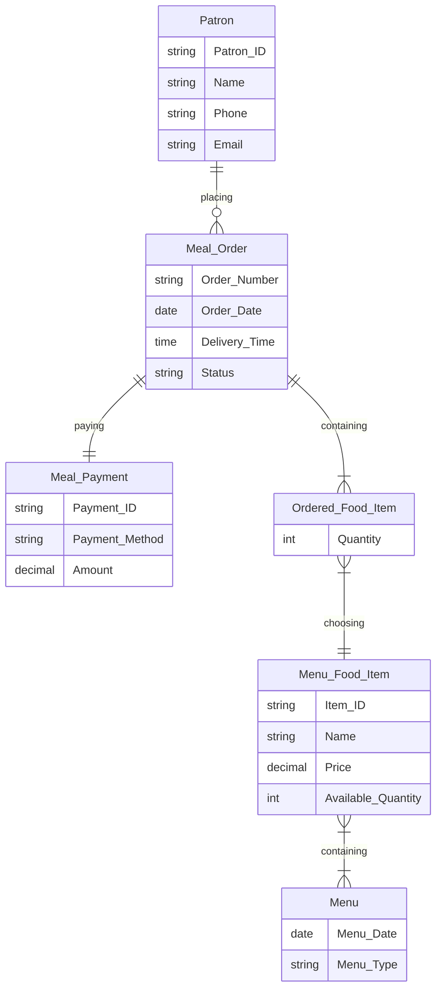
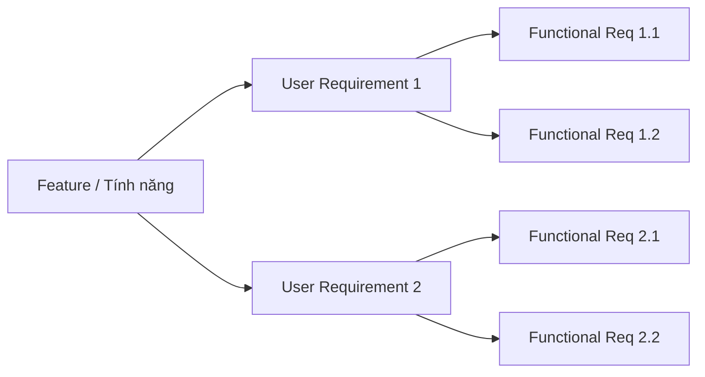
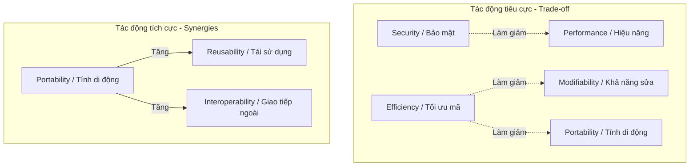
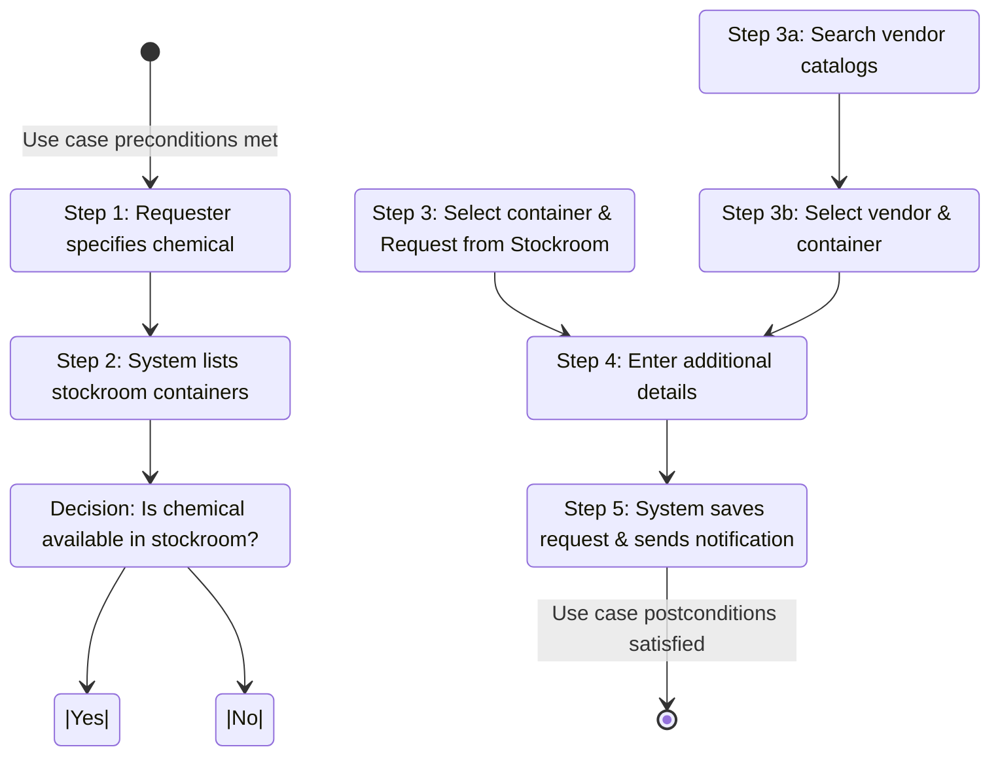
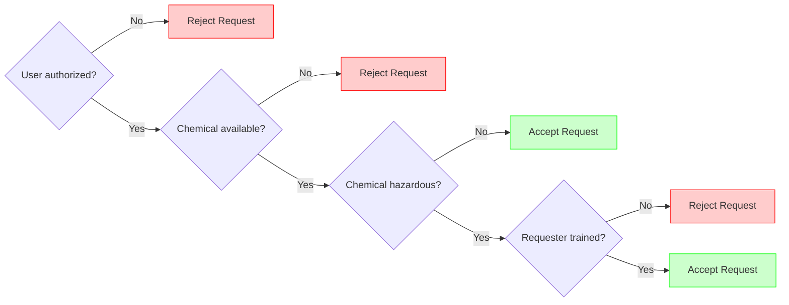
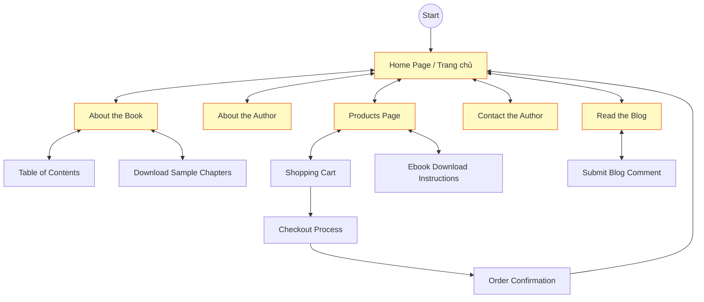
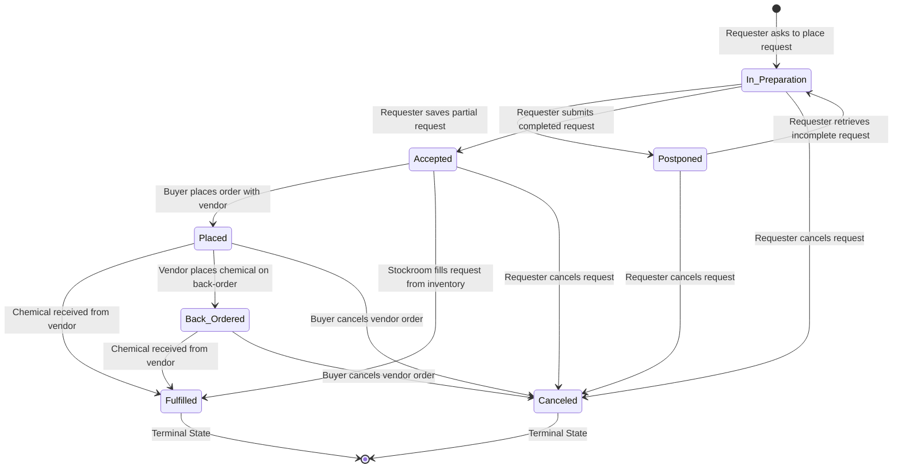
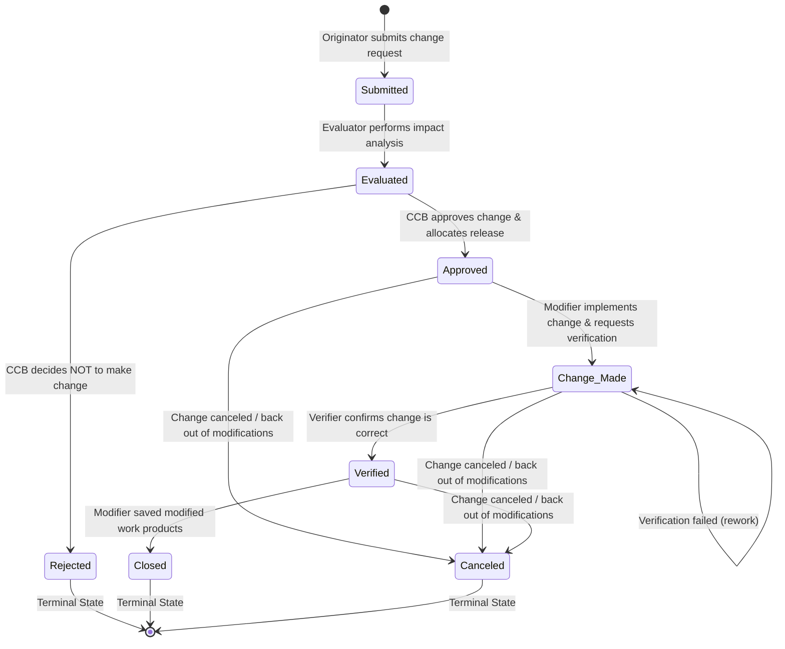
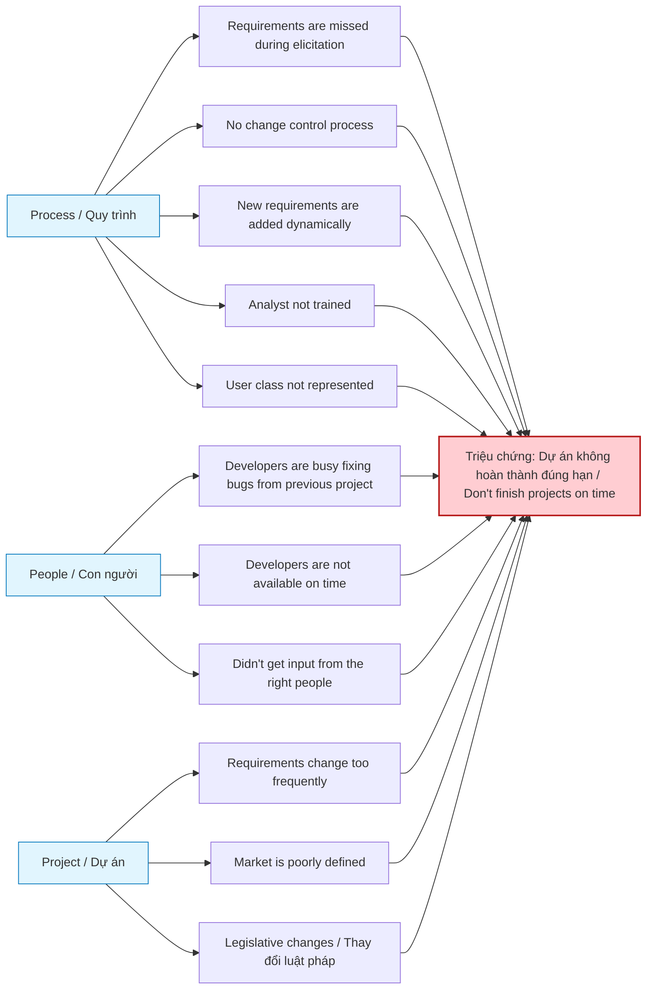
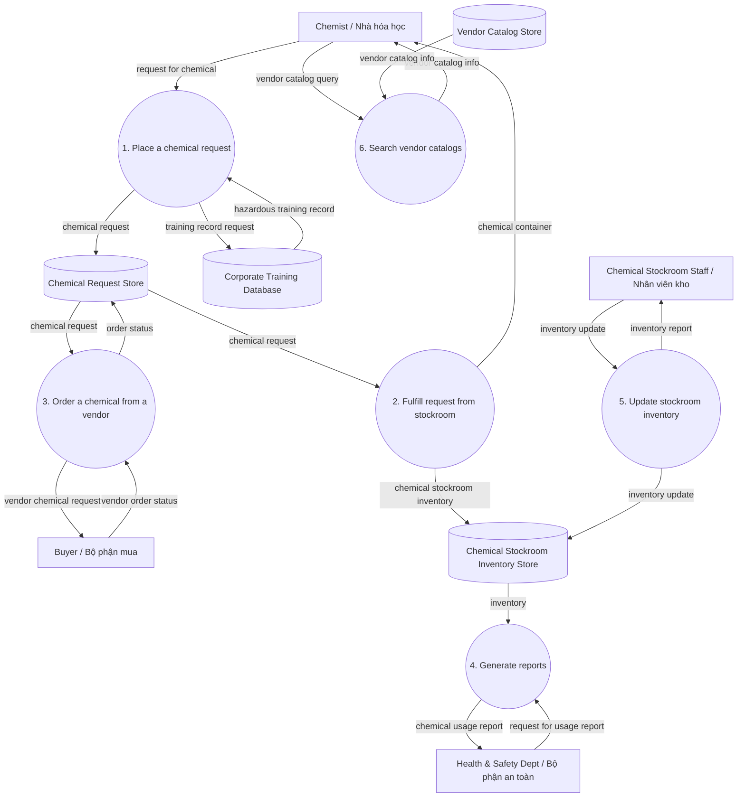

# TÀI LIỆU HƯỚNG DẪN HỌC TẬP VÀ ĐỐI CHIẾU KIẾN THỨC
## KHÓA HỌC: PHÂN TÍCH VÀ THIẾT KẾ HỆ THỐNG THÔNG TIN (SYSTEM ANALYSIS AND DESIGN)
### GIÁO TRÌNH GỐC: "SOFTWARE REQUIREMENTS" (3RD EDITION) - KARL WIEGERS & JOY BEATTY

Tài liệu này được biên soạn nhằm giúp bạn hệ thống hóa toàn bộ kiến thức lý thuyết cốt lõi từ giáo trình **"Software Requirements" (3rd Edition)**.

Tài liệu bao gồm lý thuyết trọng tâm, bảng biểu chuẩn hóa, và các sơ đồ mô hình hóa hoàn chỉnh được vẽ bằng ngôn ngữ **Mermaid.js** để bạn có thể học tập, tham khảo và ứng dụng trực quan.

---

## Phần 1: Xác định Stakeholders & Kênh truyền thông (Chương 4, 5, 6)

### 1. Lý thuyết cốt lõi từ Giáo trình
*   **Stakeholder (Bên liên quan):** Là một cá nhân, nhóm hoặc tổ chức có sự tham gia tích cực vào dự án, chịu ảnh hưởng bởi quy trình/kết quả của dự án, hoặc có khả năng gây ảnh hưởng đến quy trình/kết quả dự án (Chương 2, 6).
*   **Vai trò của Business Analyst (BA) (Hình 4-1):** BA đóng vai trò là cầu nối thông tin (cầu giao tiếp) giữa các Stakeholder phía khách hàng (đại diện nghiệp vụ) và Stakeholder phía kỹ thuật (đội ngũ lập trình, kiểm thử). BA dịch thuật ngôn ngữ nghiệp vụ của khách hàng thành ngôn ngữ kỹ thuật cho đội phát triển và ngược lại.
*   **Phân cấp Stakeholder (Hình 6-1):** 
    *   **Stakeholders** bao gồm *Customers* và *Other Stakeholders* (đội ngũ quản lý, vận hành, kiểm thử...).
    *   **Customers** bao gồm *Direct/Indirect Users* (người dùng trực tiếp/gián tiếp) và *Other Customers* (bên mua sản phẩm, ban giám đốc...).
    *   **Direct & Indirect Users** được phân rã sâu hơn thành:
        *   **Favored User Classes (Lớp người dùng được ưu tiên):** Những người có tiếng nói quyết định, sử dụng hệ thống thường xuyên nhất và mang lại giá trị cốt lõi.
        *   **Disfavored User Classes (Lớp người dùng không được ưu tiên):** Những nhóm đối tượng bị hạn chế quyền hoặc không được phép tương tác với một số chức năng (ví dụ: đối thủ cạnh tranh, người dùng không mua bản quyền).
        *   **Ignored User Classes (Lớp người dùng bị bỏ qua):** Nhóm đối tượng không cần thiết phải tối ưu giao diện hay tính năng cho họ.
        *   **Other User Classes (Lớp người dùng khác).**
*   **Product Champion (Đại diện lớp người dùng):** Một thành viên chủ chốt thuộc một lớp người dùng cụ thể, có trách nhiệm thu thập, lọc và thống nhất các yêu cầu từ lớp người dùng đó để cung cấp cho BA.

### 2. Các Kênh truyền thông (Communication Pathways - Hình 6-3)
Truyền thông tin yêu cầu từ người dùng đến lập trình viên là một chuỗi các cầu nối. Theo nghiên cứu, việc giảm thiểu các lớp trung gian (surrogates) sẽ giảm thiểu rủi ro biến dạng thông tin (trò chơi Tam Sao Thất Bản - "Telephone Game").

#### Sơ đồ các kênh truyền thông yêu cầu bằng Mermaid.js:
```mermaid
graph TD
    subgraph Người dùng đầu cuối (User Base)
        User[User / Người dùng đầu cuối]
    end

    subgraph Các đại diện trung gian (Surrogates)
        PC[Product Champion]
        FG[Focus Group]
        Mkt[Marketing]
        PM[Product Manager]
        Sales[Sales Team]
        HD[Help Desk]
        UM[User Manager]
        Proc[Procuring Customer]
        Trainer[Trainer]
    end

    subgraph Đội ngũ Requirements
        BA[Business Analyst / BA]
    end

    subgraph Đội ngũ Kỹ thuật
        Dev[Developer / Lập trình viên]
    end

    User -->|Trực tiếp| BA
    User --> PC --> BA
    User --> FG --> Mkt --> BA
    User --> Proc --> PM --> BA
    User --> HD --> BA
    User --> UM --> BA
    User --> Sales --> PM
    User --> Trainer --> BA

    BA --> Dev
    PM --> Dev
    PC --> Dev
```

---

## Phần 2: Mô hình hóa dữ liệu - ERD (Chương 13 & Appendix C)

### 1. Lý thuyết cốt lõi từ Giáo trình
*   **Entity (Thực thể):** Một đối tượng, khái niệm có thật trong môi trường nghiệp vụ mà hệ thống cần lưu trữ dữ liệu (ví dụ: Patron, Meal Order).
*   **Attribute (Thuộc tính):** Các thông tin chi tiết dùng để mô tả đặc điểm của một thực thể (ví dụ: Patron ID, Patron Name).
*   **Relationship (Mối quan hệ):** Sự liên kết lô-gíc giữa hai hay nhiều thực thể.
*   **Cardinality (Lực lượng liên kết):** Xác định số lượng thực thể liên kết với thực thể khác. Gồm 3 loại chính:
    *   **1:1 (Một - Một):** Một thực thể A chỉ liên kết với duy nhất một thực thể B.
    *   **1:N (Một - Nhiều):** Một thực thể A liên kết với nhiều thực thể B, nhưng một thực thể B chỉ liên kết với duy nhất một thực thể A.
    *   **N:M (Nhiều - Nhiều):** Một thực thể A liên kết với nhiều thực thể B và ngược lại. Cần phân rã thành thực thể trung gian trong thiết kế vật lý.

### 2. Sơ đồ thực thể liên kết (ERD) mẫu hệ thống Cafeteria Ordering System (COS) (Hình C-3)
ERD dưới đây mô tả chính xác mô hình dữ liệu lô-gíc cấp phân tích yêu cầu trong Phụ lục C của sách:



### 3. Ma trận CRUD (Create - Read - Update - Delete - Hình 13-5)
Ma trận CRUD giúp BA kiểm tra tính toàn vẹn của dữ liệu bằng cách đối chiếu các Ca sử dụng (Use Cases) với các Thực thể dữ liệu (Entities).

| Use Case (Ca sử dụng) | Order (Đơn hàng) | Chemical (Hóa chất) | Requester (Người yêu cầu) | Vendor Catalog (Danh mục NCC) |
| :--- | :---: | :---: | :---: | :---: |
| **Place Order** | C | R | R | R |
| **Change Order** | U, D | | R | R |
| **Manage Chemical Inventory**| | C, U, D | | |
| **Report on Orders** | R | R | R | |
| **Edit Requesters** | | | C, U | |

*   **Quy tắc kiểm tra toàn vẹn:** 
    *   Mỗi thực thể phải có ít nhất một chữ **C (Create)** và một chữ **R (Read)** trên toàn bộ ma trận.
    *   Nếu có thực thể được Cập nhật (U) hoặc Xóa (D) nhưng không bao giờ được tạo ra (C), hệ thống đang thiếu yêu cầu (Missing Requirement) hoặc thiếu Use Case tương ứng.

---

## Phần 3: Các cấp độ Yêu cầu phần mềm (Chương 1)

### 1. Lý thuyết cốt lõi từ Giáo trình
Karl Wiegers định nghĩa yêu cầu phần mềm bao gồm 3 cấp độ phân cấp rạch ròi, kết hợp với các yêu cầu phi chức năng và ràng buộc (Hình 1-1, 1-2):

1.  **Business Requirements (Yêu cầu doanh nghiệp):** Đại diện cho các mục tiêu cao nhất của tổ chức tài trợ phát triển dự án. Chúng xác định *tại sao* dự án được thực hiện, các lợi ích kinh tế, và các chỉ số thành công đo lường được (Success Metrics). Chúng được lưu trữ trong tài liệu **Vision and Scope (Tầm nhìn & Phạm vi)**.
2.  **User Requirements (Yêu cầu người dùng):** Thể hiện các mục tiêu hoặc tác vụ mà người dùng cụ thể phải thực hiện được bằng hệ thống để đạt được giá trị nghiệp vụ. Chúng được thể hiện bằng *Use Cases (Ca sử dụng), User Stories (Câu chuyện người dùng), hoặc Scenarios (Kịch bản sử dụng)*, lưu trữ trong tài liệu **User Requirements Document (URD)**.
3.  **Functional Requirements (Yêu cầu chức năng):** Xác định các hành vi cụ thể mà phần mềm phải thực hiện trong các điều kiện nhất định để người dùng hoàn thành tác vụ của họ. Đây là những gì lập trình viên sẽ lập trình, lưu trữ trong tài liệu **Software Requirements Specification (SRS)**.

Ngoài 3 cấp độ trên, hệ thống còn có:
*   **System Requirements (Yêu cầu hệ thống):** Yêu cầu cấp cao đối với toàn bộ sản phẩm gồm nhiều phân hệ phần cứng, phần mềm, và con người.
*   **Business Rules (Luật nghiệp vụ):** Các chính sách, quy định, công thức tính toán nằm ngoài hệ thống nhưng bắt buộc phần mềm phải tuân thủ để đảm bảo tính hợp pháp và quy chuẩn của doanh nghiệp.
*   **Quality Attributes (Thuộc tính chất lượng / Yêu cầu phi chức năng - NFR):** Các đặc tính vận hành hoặc hiệu năng của hệ thống (bảo mật, hiệu năng, tính khả dụng...).
*   **External Interfaces (Giao tiếp bên ngoài):** Định nghĩa kết nối với người dùng, phần cứng, phần mềm khác.
*   **Constraints (Ràng buộc):** Các giới hạn bắt buộc đối với việc thiết kế và lập trình (ví dụ: công nghệ sử dụng, hệ điều hành).

### 2. Sơ đồ mối quan hệ giữa các loại thông tin yêu cầu (Hình 1-1)

```mermaid
graph TD
    subgraph Nghiệp vụ & Định hướng (Business Layer)
        BR[Business Requirements / Yêu cầu doanh nghiệp]
        VS[Vision & Scope Document / Tài liệu Tầm nhìn & Phạm vi]
        BR -->|Lưu trữ trong| VS
    end

    subgraph Luật Nghiệp vụ (Regulations)
        B_Rules[Business Rules / Luật nghiệp vụ]
    end

    subgraph Người dùng (User Layer)
        UR[User Requirements / Yêu cầu người dùng]
        URD[User Requirements Document / URD]
        UR -->|Lưu trữ trong| URD
    end

    subgraph Hệ thống & Kỹ thuật (Technical Layer)
        SR[System Requirements / Yêu cầu hệ thống]
        QA[Quality Attributes / Thuộc tính chất lượng]
        EI[External Interfaces / Giao tiếp ngoài]
        Const[Constraints / Ràng buộc]
        
        FR[Functional Requirements / Yêu cầu chức năng]
        SRS[Software Requirements Specification / SRS]
        
        FR -->|Lưu trữ trong| SRS
    end

    BR -.->|Là nguồn gốc / Ảnh hưởng| UR
    UR -.->|Là nguồn gốc / Ảnh hưởng| FR
    B_Rules -.->|Ảnh hưởng| BR
    B_Rules -.->|Ảnh hưởng| UR
    B_Rules -.->|Ảnh hưởng| FR
    B_Rules -.->|Ảnh hưởng| QA
    
    SR -.->|Phân rã thành| FR
    EI -.->|Ảnh hưởng / Lưu trữ trong| SRS
    QA -.->|Ảnh hưởng / Lưu trữ trong| SRS
    Const -.->|Ảnh hưởng / Lưu trữ trong| SRS
```

### 3. Quy trình phân rã từ Tính năng sang Yêu cầu chức năng (Hình 1-2)
*   **Feature (Tính năng):** Là một tập hợp các khả năng phần mềm có tính lô-gíc chặt chẽ mang lại giá trị cho người dùng (ví dụ: Bộ kiểm tra chính tả đa ngôn ngữ). Một tính năng gồm nhiều yêu cầu người dùng, và mỗi yêu cầu người dùng lại được phân rã thành nhiều yêu cầu chức năng.




---

## Phần 4: Thuộc tính chất lượng & Sự đánh đổi (Chương 14)

### 1. Lý thuyết cốt lõi từ Giáo trình
Thuộc tính chất lượng (Quality Attributes) là một dạng của yêu cầu phi chức năng (Nonfunctional Requirements - NFR) mô tả các đặc tính vận hành hoặc chất lượng của sản phẩm phần mềm. 
Wiegers phân chia thành 2 nhóm chính:
*   **External Quality Attributes (Quan sát được bởi người dùng cuối khi chạy phần mềm):**
    *   *Availability (Tính khả dụng/Sẵn sàng):* Tỷ lệ phần trăm thời gian hệ thống hoạt động bình thường.
    *   *Installability (Khả năng cài đặt):* Sự dễ dàng khi cài đặt hệ thống vào môi trường thực tế.
    *   *Integrity (Tính toàn vẹn):* Khả năng bảo vệ dữ liệu chống lại sự truy cập bất hợp pháp hoặc mất mát dữ liệu.
    *   *Interoperability (Khả năng liên điều hành):* Khả năng trao đổi dữ liệu mượt mà với các hệ thống khác.
    *   *Performance (Hiệu năng):* Tốc độ phản hồi, băng thông, dung lượng tải của hệ thống.
    *   *Reliability (Độ tin cậy):* Khả năng hoạt động không xảy ra lỗi trong một khoảng thời gian quy định.
    *   *Robustness (Tính bền bỉ):* Khả năng hệ thống tự phục hồi hoặc hoạt động an toàn khi gặp sự cố, dữ liệu đầu vào sai.
    *   *Safety (Tính an toàn):* Đảm bảo hệ thống không gây tổn hại về người, vật chất hoặc môi trường.
    *   *Security (Tính bảo mật):* Khả năng ngăn chặn các cuộc tấn công phá hoại, rò rỉ thông tin.
    *   *Usability (Tính dễ sử dụng):* Trải nghiệm người dùng, thời gian làm quen và thao tác trên hệ thống.
*   **Internal Quality Attributes (Quan sát được bởi đội ngũ kỹ thuật/bảo trì):**
    *   *Efficiency (Hiệu quả tài nguyên):* Cách hệ thống tối ưu hóa CPU, bộ nhớ, băng thông.
    *   *Modifiability (Khả năng chỉnh sửa):* Sự dễ dàng khi bảo trì, nâng cấp phần mềm.
    *   *Portability (Tính di động):* Khả năng chuyển phần mềm sang hệ điều hành hoặc phần cứng khác.
    *   *Reusability (Tính tái sử dụng):* Khả năng tái sử dụng các khối mã nguồn cho dự án khác.
    *   *Scalability (Khả năng mở rộng):* Khả năng nâng cấp tải trọng (số người dùng, lượng dữ liệu) mà không làm suy giảm hiệu năng.
    *   *Verifiability (Khả năng kiểm thử):* Sự dễ dàng để viết kịch bản kiểm thử tích hợp, unit test.

### 2. Ma trận Ưu tiên thuộc tính chất lượng (Pairwise Comparison - Hình 14-1)
Phương pháp so sánh cặp (Pairwise ranking) giúp xếp hạng mức độ ưu tiên của các thuộc tính chất lượng khi xây dựng một hệ thống cụ thể. 
*Kí hiệu:* Dấu `<` thể hiện thuộc tính ở dòng quan trọng hơn thuộc tính ở cột. Dấu `^` thể hiện thuộc tính ở cột quan trọng hơn thuộc tính ở dòng.

| Thuộc tính (Attribute) | Điểm số | Availability | Integrity | Performance | Reliability | Robustness | Security | Usability | Verifiability |
| :--- | :---: | :---: | :---: | :---: | :---: | :---: | :---: | :---: | :---: |
| **Availability** | **2** | | ^ | ^ | ^ | ^ | ^ | ^ | < |
| **Integrity** | **6** | | | < | < | < | ^ | < | < |
| **Performance** | **4** | | | | ^ | < | ^ | ^ | < |
| **Reliability** | **2** | | | | | ^ | ^ | ^ | < |
| **Robustness** | **1** | | | | | | ^ | ^ | ^ |
| **Security** | **7** | | | | | | | < | < |
| **Usability** | **5** | | | | | | | | < |
| **Verifiability** | **1** | | | | | | | | |

*   **Kết quả:** Hệ thống này ưu tiên tối đa cho **Security (7 điểm)** và **Integrity (6 điểm)**, trong khi **Robustness (1 điểm)** và **Verifiability (1 điểm)** có độ ưu tiên thấp nhất.

### 3. Ma trận Đánh đổi Chất lượng (Quality Trade-off Matrix - Hình 14-2)
Không thể tối đa hóa tất cả thuộc tính chất lượng cùng lúc vì giữa chúng luôn tồn tại sự mâu thuẫn (đánh đổi).
*Kí hiệu:* Dấu **`+`** (Quan hệ tích cực - tăng A giúp tăng B). Dấu **`-`** (Quan hệ tiêu cực/đánh đổi - tăng A làm giảm B). Ô trống (Không ảnh hưởng đáng kể).



---

## Phần 5: Biểu đồ Ca sử dụng & Biểu đồ Hoạt động (Chương 8)

### 1. Lý thuyết cốt lõi từ Giáo trình
*   **Use Case (Ca sử dụng):** Mô tả một chuỗi các tương tác giữa một tác nhân (Actor) và hệ thống để mang lại một kết quả có giá trị cho tác nhân đó.
*   **Actor (Tác nhân):** Bất kỳ thực thể nào bên ngoài hệ thống tương tác trực tiếp với hệ thống (có thể là con người hoặc hệ thống phần mềm/phần cứng khác).
    *   *Primary Actor (Tác nhân chính):* Người kích hoạt ca sử dụng để đạt được mục tiêu cá nhân.
    *   *Secondary Actor (Tác nhân phụ):* Hệ thống hoặc đối tượng hỗ trợ hệ thống thực hiện ca sử dụng (ví dụ: Cơ sở dữ liệu đào tạo xác thực quyền hạn).
*   **Mối quan hệ trong Use Case Diagram:**
    *   **Include (Bao gồm):** Ca sử dụng A bắt buộc phải gọi ca sử dụng B (ví dụ: ca "Thanh toán đơn hàng" bao gồm ca "Đăng nhập hệ thống").
    *   **Extend (Mở rộng):** Ca sử dụng B có thể được gọi ra từ ca sử dụng A trong một số điều kiện biên đặc biệt (ví dụ: ca "Yêu cầu hóa chất" có thể mở rộng thêm ca "Tìm kiếm danh mục nhà cung cấp" nếu hóa chất không có trong kho nội bộ).

### 2. Mẫu Đặc tả Use Case chi tiết (Fully Dressed Use Case Specification)
Giáo trình Karl Wiegers cung cấp một khuôn mẫu hoàn chỉnh để ghi chép các yêu cầu người dùng (Hình 8-3):

| Trường thông tin | Nội dung đặc tả mẫu: Ca sử dụng "Yêu cầu hóa chất" (UC-4) |
| :--- | :--- |
| **ID & Tên** | UC-4 Request a Chemical |
| **Người tạo / Ngày** | Lori - 22/08/13 |
| **Tác nhân chính** | Requester (Chemist / Nhân viên phòng thí nghiệm) |
| **Tác nhân phụ** | Buyer, Chemical Stockroom Staff, Training Database System |
| **Mô tả ngắn gọn** | Người yêu cầu chỉ định loại hóa chất muốn sử dụng bằng cách nhập tên, mã ID hoặc vẽ công thức hóa học. Hệ thống kiểm tra kho nội bộ trước, nếu có sẽ cấp từ kho. Nếu không có, hệ thống cho phép người dùng đặt hàng từ nhà cung cấp bên ngoài. |
| **Tiền điều kiện (Preconditions)**| 1. Người dùng đã được xác thực danh tính.<br>2. Người dùng được cấp quyền yêu cầu hóa chất.<br>3. Cơ sở dữ liệu kho hóa chất đang trực tuyến. |
| **Hậu điều kiện (Postconditions)**| 1. Yêu cầu được lưu trữ trong hệ thống CTS.<br>2. Yêu cầu đã được gửi đến Nhân viên kho hoặc Bộ phận mua hàng. |
| **Luồng sự kiện chính (Normal Flow)**| **4.0 Yêu cầu hóa chất từ kho nội bộ:**<br>1. Người dùng chỉ định hóa chất cần yêu cầu.<br>2. Hệ thống liệt kê danh sách các thùng chứa hóa chất đang có trong kho.<br>3. Hệ thống cung cấp tùy chọn xem Lịch sử thùng chứa.<br>4. Người dùng chọn thùng hóa chất cụ thể trong kho.<br>5. Người dùng nhập thông tin bổ sung để hoàn tất yêu cầu.<br>6. Hệ thống lưu trữ và thông báo cho Nhân viên kho. |
| **Luồng thay thế (Alternative Flows)**| **4.1 Yêu cầu hóa chất từ Nhà cung cấp ngoài:**<br>1. Người dùng tìm kiếm danh mục nhà cung cấp.<br>2. Hệ thống hiển thị danh sách hóa chất từ nhà cung cấp kèm giá, kích thước đóng gói.<br>3. Người dùng chọn nhà cung cấp và kích thước đóng gói.<br>4. Người dùng nhập thông tin bổ sung.<br>5. Hệ thống lưu và gửi thông báo cho Bộ phận mua hàng (Buyer). |
| **Ngoại lệ (Exceptions)**| **4.1.E1 Hóa chất không có trên thị trường:**<br>1. Hệ thống báo lỗi "Không tìm thấy nhà cung cấp".<br>2. Hệ thống hỏi người dùng muốn yêu cầu hóa chất khác hay thoát ca sử dụng. |
| **Luật nghiệp vụ** | BR-28 (Ràng buộc an toàn đào tạo), BR-31 (Quyền hạn phê duyệt) |

### 3. Biểu đồ Use Case UML mẫu (Mermaid.js)

```mermaid
leftToRightDirection
graph TD
    subgraph Biên hệ thống CTS (Chemical Tracking System)
        UC1((Obtain MSDS))
        UC2((Request a Chemical))
        UC3((Dispose of a Chemical))
        UC4((Search Vendor Catalogs))
        UC5((Manage Inventory))
    end

    Requester[Requester / Chemists] --> UC1
    Requester --> UC2
    Requester --> UC3
    
    UC2 -->|<<includes>>| UC4
    
    Buyer[Buyer / Bộ phận mua] --> UC4
    
    Stockroom[Chemical Stockroom] --> UC5
    Stockroom --> UC2
    
    HS[Health & Safety Dept] --> UC3
    
    UC2 -.->|<<uses>>| DB[(Training Database)]
```

### 4. Biểu đồ Hoạt động UML (Activity Diagram - Hình 8-4)
Biểu đồ này mô tả chi tiết quy trình nghiệp vụ rẽ nhánh, biểu diễn luồng sự kiện chính và luồng thay thế của Ca sử dụng.




---

## Phần 6: Luật nghiệp vụ - Business Rules (Chương 9)

### 1. Lý thuyết cốt lõi từ Giáo trình
*   **Business Rule (Luật nghiệp vụ):** Là một phát biểu định nghĩa hoặc ràng buộc một số khía cạnh của doanh nghiệp. Nó thiết lập cấu trúc hoạt động hoặc kiểm soát hành vi của tổ chức. Luật nghiệp vụ nằm ngoài hệ thống phần mềm, nhưng phần mềm được xây dựng để tự động hóa hoặc thực thi các luật này (Chương 9).
*   **Phân loại 5 nhóm Luật nghiệp vụ cốt lõi:**
    1.  **Facts (Sự thật):** Các phát biểu đúng đắn, không thể bàn cãi về doanh nghiệp (ví dụ: "Mỗi thùng chứa hóa chất có một mã vạch duy nhất").
    2.  **Constraints (Ràng buộc hành vi):** Các quy định bắt buộc những gì hệ thống hoặc người dùng được phép/không được phép làm (ví dụ: "Chỉ regular employees mới được đăng ký trừ lương tự động để mua hàng").
    3.  **Action Enablers (Trình kích hoạt hành động):** Kích hoạt một tác vụ cụ thể khi một điều kiện cụ thể được đáp ứng (ví dụ: "Nếu ngày hôm nay vượt quá hạn sử dụng của thùng hóa chất, hệ thống tự động gửi email cảnh báo người sở hữu thùng đó").
    4.  **Inferences (Suy luận):** Tạo ra một thông tin mới/sự thật mới từ các sự thật đã biết trước đó (ví dụ: "Nếu tài khoản thanh toán trễ quá 30 ngày kể từ hạn nợ, tài khoản đó được coi là Delinquent - Nợ xấu").
    5.  **Computations (Phép toán):** Các công thức toán học hoặc thuật toán được doanh nghiệp thống nhất (ví dụ: Công thức tính phần trăm giảm giá theo số lượng mua trong Bảng 9-2).

### 2. Ma trận Vai trò & Quyền hạn (Roles and Permissions Matrix - Hình 9-2)
Ma trận Vai trò & Quyền hạn là một dạng trực quan hóa cực kỳ phổ biến của nhóm luật nghiệp vụ dạng Ràng buộc quyền hạn (Constraints on authorization).

| Hệ thống / Quyền hạn | Thư thủ (Librarian) | Nhân viên hỗ trợ (Clerk) | Độc giả thường (Patron) | Độc giả vãng lai (Guest) |
| :--- | :---: | :---: | :---: | :---: |
| **Tìm kiếm tài liệu** | X | X | X | X |
| **Mượn sách** | X | X | X | |
| **Trả sách** | X | X | X | |
| **Thêm độc giả mới** | X | X | | |
| **Xóa độc giả** | X | | | |
| **Thêm đầu sách mới**| X | | | |

---

## Phần 7: Logic quyết định phức tạp (Chương 12)

### 1. Lý thuyết cốt lõi từ Giáo trình
Trong phân tích yêu cầu nghiệp vụ, BA thường gặp phải các bài toán rẽ nhánh phức tạp gồm sự kết hợp của nhiều điều kiện logic đồng thời (Boolean logic: AND, OR, NOT). Việc biểu diễn các logic này bằng văn bản tự nhiên rất dễ gây hiểu lầm hoặc bỏ sót kịch bản (đặc biệt là các điều kiện ngoại lệ - Exception/Else).
Giáo trình giới thiệu 2 công cụ mô hình hóa logic tuyệt vời (Mục *Decision tables and decision trees*):
*   **Decision Table (Bảng quyết định):** Biểu diễn dưới dạng ma trận gồm các Điều kiện (Conditions) ở nửa trên, và các Hành động tương ứng (Actions) ở nửa dưới. Mỗi cột đại diện cho một quy tắc (Rule).
*   **Decision Tree (Cây quyết định):** Biểu diễn logic dưới dạng sơ đồ hình cây rẽ nhánh để kiểm tra tuần tự từng điều kiện từ trái sang phải cho đến khi đạt được hành động cuối cùng.

### 2. Bảng Quyết định Mẫu (Chemical Request Approval - Hình 12-6)
Bảng dưới đây xử lý nghiệp vụ duyệt yêu cầu hóa chất tự động trong CTS dựa trên 4 điều kiện đầu vào:

| Điều kiện (Condition) | Quy tắc 1 (Rule 1) | Quy tắc 2 (Rule 2) | Quy tắc 3 (Rule 3) | Quy tắc 4 (Rule 4) | Quy tắc 5 (Rule 5) |
| :--- | :---: | :---: | :---: | :---: | :---: |
| **1. User is authorized? (Được cấp quyền?)** | **False** | **True** | **True** | **True** | **True** |
| **2. Chemical is available? (Hóa chất có sẵn?)**| **—** | **False** | **True** | **True** | **True** |
| **3. Chemical is hazardous? (Có nguy hiểm?)** | **—** | **—** | **False** | **True** | **True** |
| **4. Requester is trained? (Đã được đào tạo?)**| **—** | **—** | **—** | **False** | **True** |
| **Hành động (Action)** | | | | | |
| **Chấp nhận yêu cầu (Accept Request)** | | | **X** | | **X** |
| **Từ chối yêu cầu (Reject Request)** | **X** | **X** | | **X** | |

*   *Ghi chú:* Dấu gạch ngang `—` thể hiện giá trị "Don't care" (Không cần quan tâm điều kiện này có giá trị gì, vì kết quả cuối cùng đã bị quyết định bởi điều kiện phía trước).

### 3. Cây Quyết định Mẫu (Mermaid.js - Hình 12-7)



---

## Phần 8: Đặc tả Yêu cầu chức năng dạng Bảng (Chương 11 & Appendix C)

### 1. Lý thuyết cốt lõi từ Giáo trình
Khi chuyển từ Use Cases sang tài liệu SRS, BA cần viết rõ ràng các yêu cầu chức năng (Functional Requirements - FR) dưới dạng các câu lệnh hành vi đơn lẻ của hệ thống.
Wiegers chỉ ra một số kỹ thuật quan trọng khi viết yêu cầu chức năng (Chương 10, 11):
*   **Sử dụng nhãn phân cấp (Hierarchical Labeling):** Giúp theo dõi và quản lý tài liệu một cách khoa học (Ví dụ: `Order.Place.Date` thể hiện yêu cầu về Ngày trong phân hệ Đặt hàng).
*   **Tránh dùng từ ngữ mơ hồ:** Tránh tuyệt đối các từ như: *should, easily, fast, robust, if possible, seamless...* Thay vào đó, hãy định lượng hóa rõ ràng hành vi hệ thống hoặc ghi chú rõ ràng các điều kiện biên.
*   **Đặc tả dạng bảng:** Cấu trúc hóa yêu cầu chức năng dưới dạng bảng giúp người đọc dễ tiếp thu hơn là một danh sách văn bản dài tản mạn.

### 2. Bản Đặc tả mẫu Chức năng Đặt món của COS (Appendix C - Hình C-2)

| Mã định danh (ID) | Chức năng nghiệp vụ & Yêu cầu chi tiết hệ thống |
| :--- | :--- |
| **Order.Place** | **Placing a meal order (Đặt món ăn)** |
| `.Register` | Hệ thống phải xác nhận xem Patron đã đăng ký tài khoản trừ lương (Payroll Deduction) chưa. |
| `.No` | Nếu Patron chưa đăng ký tài khoản trừ lương, hệ thống phải cung cấp tùy chọn đăng ký ngay lập tức, đặt món ăn và tự lấy tại căng tin (không giao hàng), hoặc thoát hệ thống. |
| `.Date` | Hệ thống phải yêu cầu Patron chọn ngày nhận món ăn (tuân thủ luật nghiệp vụ BR-8). |
| `.Cutoff` | Nếu ngày được chọn là ngày hôm nay và thời gian hiện tại đã vượt quá giờ giới hạn đặt món (Cutoff Time), hệ thống phải thông báo cho người dùng biết đã quá giờ và cho phép đổi ngày hoặc hủy đặt món. |
| **Order.Deliver** | **Delivery or pickup (Giao hàng hoặc tự lấy)** |
| `.Select` | Patron phải chỉ định hình thức nhận món ăn là giao hàng hay tự lấy tại Căng tin. |
| `.Location` | Nếu Patron chọn giao hàng, hệ thống phải kiểm tra xem có còn khung giờ giao hàng trống hay không, và yêu cầu Patron nhập vị trí giao hàng hợp lệ. |
| `.Notimes` | Nếu không còn khung giờ giao hàng nào trống, hệ thống phải thông báo cho Patron để Patron có thể hủy đơn hàng hoặc chuyển sang hình thức tự lấy tại Căng tin. |
| **Order.Units** | **Ordering multiple meals and food items (Đặt nhiều món ăn)** |
| `.Multiple` | Hệ thống phải cho phép Patron đặt nhiều món ăn giống nhau cùng một lúc, với số lượng tối đa không vượt quá lượng món ăn thực tế còn tồn kho trong cơ sở dữ liệu căng tin. |
| `.TooMany` | Nếu Patron đặt số lượng vượt quá lượng món ăn còn khả dụng trong kho, hệ thống phải thông báo cho người dùng biết số lượng tối đa thực tế có thể đặt. |

---

## Phần 9: Sơ đồ hội thoại & Phác thảo giao diện (Chương 12 & 15)

### 1. Lý thuyết cốt lõi từ Giáo trình
*   **Dialog Map (Sơ đồ hội thoại):** Là một mô hình phân tích yêu cầu giao diện ở mức trừu tượng cao (conceptual user interface design). Nó biểu diễn cấu trúc điều hướng (navigation architecture) của hệ thống bằng cách coi mỗi màn hình, trang web, hộp thoại là một trạng thái, và các liên kết điều hướng là các mũi tên chuyển trạng thái (Chương 12, 15).
*   Sơ đồ hội thoại giúp BA thảo luận luồng trải nghiệm người dùng (UX) với khách hàng từ rất sớm mà không bị sa đà vào các chi tiết thiết kế đồ họa (như màu sắc, logo, font chữ).
*   **Low-fidelity Wireframe / Sketch (Phác thảo giao diện thô - Hình 15-4):** Là các hình vẽ thô mô tả bố cục (layout) của các phần tử trên màn hình (nút bấm, ô nhập liệu, danh sách lựa chọn) phục vụ cho việc kiểm chứng yêu cầu chức năng.
*   **DAR (Display-Action-Response) Model (Hình 19-5):** Là bảng đặc tả chi tiết đi kèm với màn hình phác thảo, mô tả giao diện hiển thị cái gì (Display), người dùng tương tác gì (Action), và hệ thống phản hồi lại thế nào (Response).

### 2. Sơ đồ Hội thoại Mẫu cho PearlsFromSand.com (Hình 15-3)



---

## Phần 10: Quản lý trạng thái & Thay đổi (Chương 12, 27, 28)

### 1. Lý thuyết cốt lõi từ Giáo trình
*   **State-Transition Diagram - STD (Biểu đồ chuyển trạng thái):** Biểu diễn vòng đời của một đối tượng dữ liệu quan trọng hoặc tiến trình xử lý từ khi bắt đầu cho đến trạng thái kết thúc (termination states). 
    *   Hộp chữ nhật biểu diễn các **Trạng thái (States)**.
    *   Mũi tên chỉ hướng thể hiện sự **Chuyển dịch trạng thái (Transitions)**.
    *   Nhãn trên mũi tên chỉ rõ **Sự kiện kích hoạt (Event/Trigger)** gây ra sự dịch chuyển đó (Chương 12).
*   **State Table (Bảng chuyển trạng thái - Hình 12-4):** Biển diễn cùng nội dung thông tin với STD dưới dạng ma trận hai chiều (Dòng là Trạng thái hiện tại, Cột là Trạng thái tiếp theo) để đảm bảo BA kiểm tra đầy đủ 100% các kịch bản chuyển trạng thái, tránh lỗi thiếu sót logic.
*   **Quy trình quản lý yêu cầu thay đổi (Change Control Process - Hình 28-1, 28-2):** Đảm bảo mọi đề xuất thay đổi yêu cầu từ khách hàng đều phải đi qua các bước đánh giá tác động (Impact Analysis), phê duyệt bởi Ban Quản Lý Thay Đổi (CCB - Change Control Board) trước khi được cập nhật vào mã nguồn và tài liệu.

### 2. Sơ đồ Trạng thái của một Yêu cầu hóa chất (CTS - Hình 12-3)
Mô tả vòng đời của một yêu cầu hóa chất từ lúc chuẩn bị đến khi hoàn thành hoặc bị hủy:



### 3. Vòng đời Trạng thái của một Yêu cầu thay đổi (Change Request - Hình 28-2)
Mô tả quy trình nghiệp vụ kiểm soát thay đổi phần mềm chuẩn hóa của CCB:



---

## Phần 11: Phân tích nguyên nhân gốc rễ & Cải tiến quy trình (Chương 31)

### 1. Lý thuyết cốt lõi từ Giáo trình
*   **Root Cause Analysis (Phân tích nguyên nhân gốc rễ):** Là hoạt động tìm kiếm có hệ thống các yếu tố sâu xa bên dưới dẫn đến sự xuất hiện của một vấn đề/triệu chứng không mong muốn trong dự án (ví dụ: dự án bị trễ hạn, phần mềm nhiều lỗi), thay vì chỉ giải quyết phần ngọn (Chương 31).
*   **Biểu đồ nhân quả xương cá (Cause-and-Effect / Ishikawa / Fishbone Diagram - Hình 31-4):** Công cụ trực quan hóa giúp phân loại các nguyên nhân tiềm tàng gây ra lỗi vào các nhóm chính:
    *   **Process (Quy trình):** Thiếu quy trình kiểm soát, quy trình thu thập yêu cầu không chuẩn hóa.
    *   **People (Con người):** BA chưa được đào tạo bài bản, người dùng không có thời gian tham gia làm rõ yêu cầu.
    *   **Project (Dự án):** Yêu cầu thay đổi quá thường xuyên, quản lý phạm vi lỏng lẻo.
    *   **Technology / Tools (Công nghệ/Công cụ):** Công cụ quản lý yêu cầu lỗi thời, tài liệu hóa kém.

### 2. Biểu đồ Xương cá phân tích nguyên nhân "Dự án trễ hạn" (Hình 31-4 / Hình 31-6)



---

## Phần 12: Sơ đồ luồng dữ liệu - DFD (Chương 12)

### 1. Lý thuyết cốt lõi từ Giáo trình
*   **Data Flow Diagram - DFD (Biểu đồ luồng dữ liệu):** Là công cụ nền tảng của phương pháp phân tích hướng cấu trúc (structured analysis). DFD biểu diễn cách thức dữ liệu di chuyển qua hệ thống, các tiến trình xử lý biến đổi dữ liệu đó, các kho lưu trữ dữ liệu, và các tác nhân ngoài trao đổi dữ liệu với hệ thống (Chương 12).
*   **4 thành phần cơ bản của DFD (Ký pháp Yourdon-DeMarco):**
    1.  **Process (Tiến trình xử lý - Hình tròn/Oval):** Thể hiện một hành động biến đổi dữ liệu đầu vào thành dữ liệu đầu ra (ví dụ: Tính toán hóa đơn, Duyệt yêu cầu).
    2.  **External Entity / Terminator (Tác nhân ngoài - Hình chữ nhật):** Thực thể nằm ngoài hệ thống nhưng trao đổi thông tin trực tiếp với hệ thống (ví dụ: Khách hàng, Ngân hàng liên kết).
    3.  **Data Store (Kho dữ liệu - Hai đường thẳng song song):** Nơi lưu trữ dữ liệu tạm thời hoặc vĩnh viễn (ví dụ: Kho đơn hàng, Danh mục sản phẩm).
    4.  **Data Flow (Luồng dữ liệu - Mũi tên có nhãn):** Chỉ ra hướng di chuyển và nội dung của thông tin di chuyển qua hệ thống.

*   **Sự khác biệt giữa DFD và Context Diagram (Sơ đồ ngữ cảnh):**
    *   *Context Diagram (Sơ đồ ngữ cảnh):* Là cấp độ cao nhất của DFD (DFD cấp ngữ cảnh). Nó coi toàn bộ hệ thống là một **Tiến trình Black-box duy nhất** (hình tròn lớn ở giữa) và chỉ thể hiện các tác nhân ngoài và luồng dữ liệu đi vào/ra hệ thống. Không thể hiện kho dữ liệu nội bộ.
    *   *DFD Level 0 (DFD cấp 0):* Phân rã tiến trình duy nhất ở sơ đồ ngữ cảnh thành các tiến trình xử lý chính (thường từ 3 đến 7 tiến trình) và thể hiện các kho dữ liệu nội bộ kết nối giữa các tiến trình đó.

### 2. Sơ đồ DFD Level 0 mẫu của hệ thống Chemical Tracking System (CTS - Hình 12-1)
Sơ đồ dưới đây mô tả chính xác sự di chuyển của luồng dữ liệu giữa 6 tiến trình cốt lõi của CTS:



---

## PHẦN KẾT LUẬN & TỔNG KẾT NGUYÊN TẮC CỐT LÕI

Cuốn sách **"Software Requirements" (3rd Edition)** của Karl Wiegers và Joy Beatty là một trong những tài liệu chuẩn hóa quốc tế tốt nhất về Requirements Engineering (Kỹ nghệ yêu cầu). Trong Phân tích & Thiết kế Hệ thống Thông tin (SAD), việc áp dụng chính xác các thuật ngữ chuyên ngành và mô hình hóa trực quan từ cuốn sách này giúp tài liệu phân tích đạt tính khoa học, chuẩn hóa và thực tiễn cao.

### 💡 4 Nguyên tắc vàng trong Kỹ nghệ Yêu cầu:
1.  **Luôn dò vết yêu cầu (Traceability):** Đảm bảo mỗi thuộc tính trong mô hình dữ liệu (ERD) đều được xử lý bởi ít nhất một tiến trình trong mô hình luồng (DFD) và được truy xuất bởi ít nhất một màn hình (Dialog Map).
2.  **Định lượng hóa yêu cầu phi chức năng:** Đừng viết "Hệ thống phải phản hồi nhanh". Hãy viết "Hệ thống phải hiển thị kết quả truy vấn trong vòng tối đa 2.0 giây dưới điều kiện tải thông thường" (Áp dụng Planguage).
3.  **Bao phủ mọi kịch bản logic biên:** Khi thiết kế bảng quyết định hoặc luồng hoạt động (Activity Diagram), hãy luôn tự hỏi kịch bản "Else" hoặc "Exception" là gì. Điều này giúp hệ thống không bị "treo" hoặc lỗi logic khi vận hành.
4.  **Sử dụng ký pháp chuẩn hóa:** Tránh việc tự sáng tạo ra các biểu tượng mới trên sơ đồ. Sử dụng đúng ký pháp UML (cho Use Case, Activity, State) và Yourdon-DeMarco (cho DFD) để lập trình viên và các bên liên quan có chung một ngôn ngữ hiểu biết.

---
### 🛠️ Cách sử dụng tài liệu học tập này:
Tài liệu này được định dạng dưới dạng tệp Markdown. Bạn có thể sao chép trực tiếp nội dung hoặc các đoạn mã sơ đồ **Mermaid.js** để dán vào các trình đọc Markdown hỗ trợ Mermaid (như Obsidian, Notion, GitHub, hoặc VS Code) để xem sơ đồ hiển thị trực quan và tinh chỉnh mã nguồn sơ đồ một cách dễ dàng.
